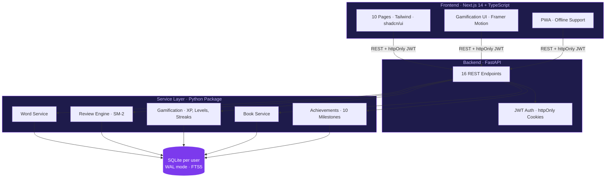

<div align="center">

# 📚⚔️ ReadLoot

### A vocabulary RPG that turns reading into a game.

Collect words from books. Review with spaced repetition. Earn XP. Level up. Unlock achievements.

[](https://github.com/sandeepdanda/readloot/actions)
[](LICENSE)
[](https://www.python.org/downloads/)
[](https://nextjs.org/)

</div>

---

## The Loop


Words come back at increasing intervals (1, 1, 3, 7, 14, 30 days) as you master them. Every correct answer earns XP, builds streaks, and unlocks achievements.

## Features

| | | |
|---|---|---|
| 🧠 **Spaced Repetition** | 6 mastery levels with SM-2 intervals | Words come back when you're about to forget |
| ⚔️ **XP & Levels** | Novice → Page Turner → Bookworm → Word Smith → Lexicon Lord → Master | +10 XP per word, +5 XP per correct review |
| 🔥 **Streaks** | Daily activity tracking | Consecutive days keep your streak alive |
| 🏆 **10 Achievements** | Word milestones, streak goals, perfect reviews | Animated toasts when you unlock them |
| ✨ **Word of the Day** | Date-seeded, mastery-weighted | Resurfaces words you haven't seen in a while |
| 📚 **Book Organization** | Words grouped by book and chapter | Browse your vocabulary by source |
| 🔍 **Full-text Search** | SQLite FTS5 | Search across words, meanings, synonyms, context |
| 🌙 **Dark/Light/System** | Three theme modes | PWA installable on mobile |

## Architecture



The backend doesn't reimplement business logic - it imports the CLI package and calls service functions directly. Fix something in the service layer and both CLI and web get the fix.

## Gamification


## Quick Start

```bash
git clone https://github.com/sandeepdanda/readloot.git
cd readloot

# Backend
pip install -e . && pip install -r backend/requirements.txt
cd backend && uvicorn app.main:app --reload    # http://localhost:8000

# Frontend (new terminal)
cd frontend && npm install && npm run dev       # http://localhost:3000
```

Or use the CLI standalone:

```bash
pip install -e .
vault add "ephemeral" --book "Sapiens" --chapter "Ch 1" --meaning "lasting a short time"
vault review          # spaced repetition quiz
vault stats           # XP, level, streak
```

## What's Next

Auto-vocabulary extraction from books, word rarity tiers, FSRS algorithm, boss battles, and more. See [ROADMAP.md](ROADMAP.md).

For full architecture, API docs, schema, and security details: [PROJECT.md](PROJECT.md)

## License

MIT ([Full text](LICENSE))
