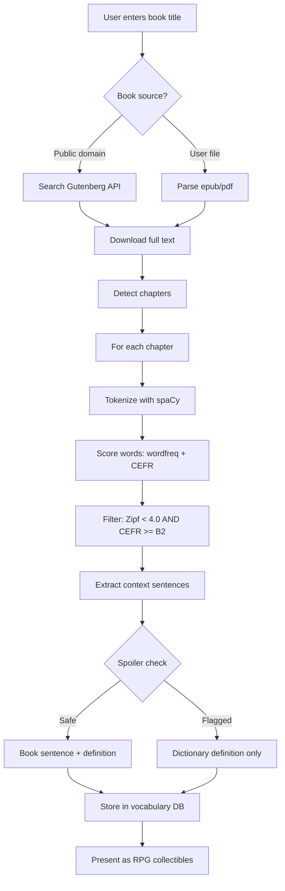

# Automatic Vocabulary Extraction from Books - Research

## Executive Summary

Building an auto-vocabulary system for ReadLoot requires solving five problems: getting book text, identifying hard words, providing spoiler-free context, detecting chapters, and doing it all without reinventing the wheel. This document covers each area with concrete libraries, APIs, and architecture recommendations.

The recommended stack: `ebooklib` for epub parsing, `wordfreq` + `cefrpy` for difficulty scoring, `spaCy` for NLP pipeline, and `BookNLP` for character/entity detection (used in spoiler filtering). For book content, Project Gutenberg (public domain) is the only fully legal source for full text; copyrighted books require user-supplied epub/pdf files.

---

## 1. Book Content Sources

### 1.1 Project Gutenberg (Best for Public Domain)

- **What**: 70,000+ free public domain ebooks (pre-1928 US copyright)
- **Full text access**: Yes - plain text, HTML, and epub formats
- **API**: No official API, but several community options:
  - **Gutendex** (https://gutendex.com) - JSON REST API for metadata + download links. Free, no auth required.
    - `GET /books?search=pride+and+prejudice` returns metadata + text URLs
    - Text files at `https://www.gutenberg.org/files/{id}/{id}-0.txt`
  - **gutenbergapi.com** - commercial wrapper with 76,000+ books
  - **gutenberg_api** (GitHub: GnikDroy) - self-hosted REST API for full catalogue
- **Python**: `gutenberg` PyPI package for direct download
- **Legal**: Fully public domain in the US. Some restrictions in other countries.
- **Limitation**: Only classic/older books. No modern bestsellers.

```python
# Example: Download a book from Project Gutenberg
import requests

book_id = 1342  # Pride and Prejudice
url = f"https://www.gutenberg.org/files/{book_id}/{book_id}-0.txt"
text = requests.get(url).text
```

### 1.2 Open Library API

- **What**: Internet Archive's book metadata API (part of openlibrary.org)
- **Full text access**: Limited - only for books in their lending library (borrowing model)
- **API**: `https://openlibrary.org/api/books?bibkeys=ISBN:0451526538&format=json`
- **Useful for**: Book metadata (title, author, ISBN, cover images, subjects, table of contents)
- **Legal**: Metadata is open. Full text requires "borrowing" and is DRM-protected.
- **Verdict**: Good for metadata lookup, not for text extraction.

### 1.3 Google Books API

- **What**: Google's book search and preview API
- **Full text access**: No. Only snippets and limited preview pages.
- **API**: `https://www.googleapis.com/books/v1/volumes?q=isbn:0451526538`
- **Useful for**: Book metadata, cover images, categories, page count, preview links
- **Embedded Viewer API**: Can embed preview pages in web apps (JavaScript)
- **Legal**: Snippets only. Cannot extract full text programmatically.
- **Verdict**: Good for book identification and metadata, not for vocabulary extraction.

### 1.4 User-Supplied Files (Best for Copyrighted Books)

This is the most practical approach for modern/copyrighted books:

| Format | Parser | Notes |
|--------|--------|-------|
| **EPUB** | `ebooklib` + `BeautifulSoup` | Best format. Structured HTML chapters. |
| **PDF** | `PyMuPDF` (fitz), `pdfplumber` | Harder - no semantic structure, layout-dependent |
| **Kindle (.mobi/.azw3)** | `calibre` CLI (`ebook-convert`) | Convert to epub first, then parse |
| **Plain text** | Built-in Python | Simplest but no chapter structure |

```python
# Example: Parse epub with ebooklib
import ebooklib
from ebooklib import epub
from bs4 import BeautifulSoup

book = epub.read_epub('book.epub')
for item in book.get_items_of_type(ebooklib.ITEM_DOCUMENT):
    soup = BeautifulSoup(item.get_content(), 'html.parser')
    text = soup.get_text()
```

### 1.5 Kindle Highlights/Vocabulary Builder Export

- Kindle stores looked-up words in `vocab.db` (SQLite) on the device
- Path: `/Volumes/Kindle/system/vocabulary/vocab.db`
- Contains: word, stem, usage context (the sentence), book title, timestamp
- Tools: `kindle_vocab_anki` (GitHub: wzyboy) exports to Anki
- **Obsidian plugin**: "Kindle Vocab" imports vocabulary with context sentences
- **Limitation**: Only words the user manually looked up, not auto-extracted

### 1.6 Legal Summary

| Source | Full Text? | Legal for Extraction? | Book Coverage |
|--------|-----------|----------------------|---------------|
| Project Gutenberg | Yes | Yes (public domain) | Pre-1928 classics only |
| Open Library | Borrowing only | No (DRM) | Large but restricted |
| Google Books | Snippets only | No (ToS prohibits) | Huge but no full text |
| User epub/pdf | Yes | Yes (personal use) | Whatever user owns |
| Kindle vocab.db | Context sentences | Yes (personal use) | User's lookups only |

**Recommendation**: Support two paths:
1. Project Gutenberg integration for classics (auto-fetch by title)
2. User file upload (epub preferred) for modern books

---

## 2. Vocabulary Identification

### 2.1 Core Approach: Word Frequency as Difficulty Proxy

The most reliable signal for "vocabulary-worthy" words is **how rarely they appear in general language**. Rare words are harder words. Three complementary methods:

#### Method A: wordfreq Library (Zipf Scale)

The `wordfreq` library (by Robyn Speer) provides word frequencies from 8+ sources (Wikipedia, subtitles, news, books, web, Twitter, Reddit) across 40+ languages.

- **Zipf scale**: Logarithmic, human-friendly. Range 0-8.
  - Zipf 7+ = ultra-common ("the", "to", "and")
  - Zipf 5-6 = common ("word", "house", "think")
  - Zipf 3-4 = intermediate ("frequency", "elaborate", "scrutiny")
  - Zipf 1-2 = rare ("defenestrate", "pulchritude")
  - Zipf 0 = not in wordlist
- **Threshold**: Words with Zipf < 4.0 are generally "vocabulary-worthy" for native speakers. For ESL learners, Zipf < 5.0.

```python
from wordfreq import zipf_frequency

# Common word
zipf_frequency('happy', 'en')      # ~5.2
# Vocabulary-worthy word
zipf_frequency('ephemeral', 'en')  # ~2.8
# Very rare
zipf_frequency('defenestrate', 'en')  # ~1.5
```

- **Note**: wordfreq data is frozen at ~2021. Author states the project is "sunset" due to LLM-contaminated web data making new frequency counts unreliable. Still the best available resource.

#### Method B: CEFR Level Classification (cefrpy)

The `cefrpy` library maps words to CEFR levels (A1-C2) based on the Common European Framework of Reference for Languages.

- **Levels**: A1 (beginner) through C2 (mastery)
  - A1-A2: Basic vocabulary ("house", "eat", "happy")
  - B1-B2: Intermediate ("investigate", "potential", "evolve")
  - C1-C2: Advanced ("benefactor", "longevity", "withstand")
- **POS-aware**: Same word can have different levels depending on part of speech
- **Integrates with spaCy**: `CEFRSpaCyAnalyzer` processes full text with entity exclusion

```python
from cefrpy import CEFRAnalyzer

analyzer = CEFRAnalyzer()
level = analyzer.get_average_word_level_CEFR("ephemeral")  # C1 or C2
level = analyzer.get_average_word_level_CEFR("happy")      # A1
```

- **Threshold for ReadLoot**: B2+ words (level >= 4.0 on float scale) are vocabulary-worthy for most readers.

#### Method C: Academic Word Lists

- **AWL (Academic Word List)**: 570 word families common in academic texts but not in general English. Divided into 10 sublists by frequency.
- **AVL (Academic Vocabulary List)**: 3,000 words from COCA corpus, covers ~14% of academic text.
- **COCA frequency bands**: Words ranked by frequency in the 1-billion-word Corpus of Contemporary American English. Words outside the top 5,000 are generally "hard".
- **Use case**: Good for non-fiction books. Less relevant for fiction.

### 2.2 Filtering Pipeline

Combine methods for best results:

```
Raw text
  → Tokenize (spaCy)
  → Lemmatize
  → Filter out: stopwords, proper nouns, numbers, punctuation
  → Filter out: words with Zipf > 5.0 (too common)
  → Score remaining words:
      - wordfreq Zipf score (lower = harder)
      - CEFR level (higher = harder)
      - Combined score = weighted average
  → Rank by difficulty
  → Take top N per chapter
```

### 2.3 Recommended Python Libraries

| Library | Purpose | Install |
|---------|---------|---------|
| `wordfreq` | Word frequency lookup (Zipf scale) | `pip install wordfreq` |
| `cefrpy` | CEFR level classification | `pip install cefrpy` |
| `spacy` | Tokenization, POS tagging, NER, lemmatization | `pip install spacy` + `python -m spacy download en_core_web_sm` |
| `nltk` | Stopwords, WordNet definitions | `pip install nltk` |
| `booknlp` | Character detection, entity recognition for books | `pip install booknlp` |

### 2.4 Additional Signals for "Interesting" Words

Beyond raw frequency, consider:
- **Part of speech**: Prefer nouns, verbs, adjectives over function words
- **Domain specificity**: Words common in one genre but rare overall (e.g., "rigging" in sailing books)
- **Morphological complexity**: Words with Latin/Greek roots, prefixes, suffixes
- **Context uniqueness**: Words used in unusual or figurative ways in the specific book

---

## 3. Spoiler-Free Context Generation

### 3.1 The Problem

When showing a vocabulary word from Chapter 5, you can't show a sentence like: "After John **betrayed** his brother and stole the inheritance, he fled to Paris." That reveals plot.

### 3.2 Approaches (Ranked by Practicality)

#### Approach 1: Dictionary Definitions + Generic Examples (Safest)

- Use dictionary API for definition and example sentence (not from the book)
- APIs: Free Dictionary API (`https://api.dictionaryapi.dev/api/v2/entries/en/{word}`), WordNet via NLTK, Merriam-Webster API
- **Pros**: Zero spoiler risk, consistent quality
- **Cons**: Loses the book-specific context that makes vocabulary memorable

```python
import nltk
from nltk.corpus import wordnet

synsets = wordnet.synsets('ephemeral')
# Definition: 'lasting a very short time'
# Example: 'the ephemeral joys of childhood'
```

#### Approach 2: Minimal Book Context (Recommended Hybrid)

Show only the immediate sentence containing the word, with spoiler heuristics:

1. Extract the sentence containing the target word
2. Run spoiler detection checks:
   - Does it contain character names involved in key plot events? (Use BookNLP entity detection)
   - Does it contain spoiler-indicator verbs? ("died", "killed", "married", "betrayed", "revealed")
   - Does it contain future-tense plot references?
3. If flagged as potential spoiler: fall back to dictionary definition
4. If safe: show the sentence with the target word highlighted

```python
SPOILER_VERBS = {'died', 'killed', 'murdered', 'married', 'betrayed',
                 'revealed', 'discovered', 'escaped', 'survived', 'confessed'}

def is_potential_spoiler(sentence, characters):
    """Basic spoiler heuristic."""
    words = set(sentence.lower().split())
    has_character = any(c.lower() in sentence.lower() for c in characters)
    has_spoiler_verb = bool(words & SPOILER_VERBS)
    return has_character and has_spoiler_verb
```

#### Approach 3: Sentence Decontextualization

Academic NLP research (arxiv.org/html/2509.17921v1) explores making extracted sentences standalone by resolving coreferences and removing context dependencies. This is complex but could be used to:
- Replace character names with generic labels ("A man", "The protagonist")
- Resolve pronouns to generic references
- Strip plot-specific details while keeping the word usage

#### Approach 4: LLM-Based Paraphrasing

Use an LLM to generate a spoiler-free example sentence that preserves the word's meaning and usage pattern from the book, without revealing plot:

```
Prompt: "The word 'ephemeral' appears in this book sentence: [sentence].
Generate a new example sentence that uses 'ephemeral' in a similar way
but contains no plot details, character names, or story events."
```

- **Pros**: High quality, contextually appropriate
- **Cons**: Requires LLM API calls, adds latency and cost

### 3.3 BookNLP for Spoiler Detection

BookNLP (https://github.com/booknlp/booknlp) is specifically designed for book-length NLP:
- **Character name clustering**: Groups "Tom", "Tom Sawyer", "Mr. Sawyer" into one entity
- **Quotation speaker identification**: Links dialogue to characters
- **Event tagging**: Identifies key events (useful for spoiler detection)
- **Coreference resolution**: Resolves "he", "she", "they" to named characters

Running BookNLP on a full book takes ~1 hour on CPU but produces a rich entity/event map that can power spoiler detection.

### 3.4 Recommended Strategy

```
For each vocabulary word:
  1. Extract book sentence containing the word
  2. Run lightweight spoiler check (character names + spoiler verbs)
  3. If SAFE → show book sentence + dictionary definition
  4. If FLAGGED → show dictionary definition + generic example only
  5. Store both for user to optionally reveal book context
```

---

## 4. Existing Tools and Prior Art

### 4.1 Kindle Vocabulary Builder

- **How it works**: When you look up a word on Kindle, it's saved to Vocabulary Builder with the sentence context
- **Storage**: SQLite database (`vocab.db`) on device
- **Export tools**: `kindle_vocab_anki` (GitHub), Obsidian "Kindle Vocab" plugin, KindleVocabToAnki app
- **Limitation**: Manual - only captures words the user actively looks up
- **What ReadLoot can learn**: The sentence-in-context model is proven effective for retention

### 4.2 LingQ

- **How it works**: Import text (books, articles, podcasts). Unknown words highlighted in yellow ("LingQs"). User clicks to see translation/definition. Words tracked through SRS.
- **Key feature**: Tracks word status (new → recognized → learned → known)
- **Book support**: Users import epub/text. LingQ splits into "lessons" (pages).
- **6+ years of daily use reported** by power users for reading books in foreign languages
- **What ReadLoot can learn**: The progressive word-status model (new → known) and the reading-integrated lookup UX

### 4.3 ReadLang

- **How it works**: Web-based reader. Click any word for instant translation. Words saved to flashcard deck.
- **Book support**: Paste text or import web pages
- **What ReadLoot can learn**: The click-to-save interaction pattern

### 4.4 Vocabulary.com

- **How it works**: Curated vocabulary lists, adaptive quizzing, "Vocabulary Jam" competitions
- **Book lists**: Has pre-made vocabulary lists for popular books (SAT prep, literature)
- **What ReadLoot can learn**: Gamification (points, levels, streaks) and pre-made book word lists

### 4.5 BookNLP (Research Tool)

- **What**: NLP pipeline for books - character extraction, event tagging, quote attribution
- **Not a vocabulary tool**, but provides the entity/event infrastructure needed for spoiler-free context
- **GitHub**: https://github.com/booknlp/booknlp

### 4.6 GradeSaver / SparkNotes Glossaries

- Many literature study sites provide vocabulary/glossary lists for classic books
- Could be used as validation data (compare auto-extracted vocab against human-curated lists)
- **Paperspace blog** demonstrated scraping GradeSaver glossaries + Project Gutenberg text for NLP glossary extraction

### 4.7 Linga (iOS App)

- Books with inline translations. Tap word for translation. Vocabulary tracking.
- Focused on language learners reading in foreign languages.

### 4.8 Gap Analysis - What ReadLoot Adds

| Feature | Kindle VB | LingQ | ReadLang | Vocab.com | **ReadLoot** |
|---------|-----------|-------|----------|-----------|---------------------|
| Auto-extract vocab from book | No | No | No | Curated only | **Yes** |
| Per-chapter organization | No | By lesson | No | No | **Yes** |
| Difficulty scoring (CEFR/Zipf) | No | No | No | Partial | **Yes** |
| Spoiler-free context | N/A | N/A | N/A | N/A | **Yes** |
| RPG/gamification | No | Partial | No | Yes | **Yes** |
| Works with any book | Kindle only | Import | Web only | Curated | **Yes (epub/Gutenberg)** |

---

## 5. Chapter Detection

### 5.1 EPUB Files (Structured - Easiest)

EPUBs are ZIP archives containing XHTML files. Chapters are typically separate XHTML documents.

```python
import ebooklib
from ebooklib import epub
from bs4 import BeautifulSoup

book = epub.read_epub('book.epub')

# Method 1: Use spine order (most reliable)
chapters = []
for item_id, linear in book.spine:
    item = book.get_item_with_id(item_id)
    if item:
        soup = BeautifulSoup(item.get_content(), 'html.parser')
        text = soup.get_text(strip=True)
        if len(text) > 500:  # Skip short items (cover, copyright, etc.)
            chapters.append({
                'id': item_id,
                'text': text,
                'title': _extract_chapter_title(soup)
            })

# Method 2: Use table of contents
toc = book.toc  # Returns list of Link/Section objects
```

**Chapter title extraction from HTML**:
```python
def _extract_chapter_title(soup):
    """Extract chapter title from heading tags."""
    for tag in ['h1', 'h2', 'h3']:
        heading = soup.find(tag)
        if heading:
            return heading.get_text(strip=True)
    return None
```

**Common spine patterns** (from real epub files):
```
('cover', 'no'), ('titlepage', 'yes'), ('chapter001', 'yes'),
('chapter002', 'yes'), ..., ('appendix', 'yes'), ('copyright', 'yes')
```

Filter by: item ID containing "chapter", or items with `linear='yes'` and sufficient text length.

### 5.2 Plain Text Files (Unstructured - Harder)

For Project Gutenberg plain text or user-pasted text:

```python
import re

CHAPTER_PATTERNS = [
    r'^CHAPTER\s+[IVXLCDM\d]+',           # CHAPTER I, CHAPTER 1
    r'^Chapter\s+[IVXLCDM\d]+',           # Chapter I, Chapter 1
    r'^BOOK\s+[IVXLCDM\d]+',              # BOOK I (for multi-part works)
    r'^Part\s+[IVXLCDM\d]+',              # Part I
    r'^\d+\.\s+\w+',                       # 1. Title
    r'^[IVXLCDM]+\.\s',                    # I. Title
]

def detect_chapters(text):
    """Split plain text into chapters using regex patterns."""
    combined = '|'.join(f'({p})' for p in CHAPTER_PATTERNS)
    splits = re.split(f'({combined})', text, flags=re.MULTILINE)
    # Group splits into chapters...
```

### 5.3 PDF Files (Layout-Dependent - Hardest)

- Use `PyMuPDF` (fitz) for text extraction with position info
- Chapter headings are often larger font size or bold
- Detect by: font size changes, page breaks + centered text, ToC page references

```python
import fitz  # PyMuPDF

doc = fitz.open('book.pdf')
for page in doc:
    blocks = page.get_text("dict")["blocks"]
    for block in blocks:
        for line in block.get("lines", []):
            for span in line["spans"]:
                if span["size"] > 14:  # Larger font = likely heading
                    print(f"Possible chapter: {span['text']}")
```

### 5.4 Recommended Approach

```
1. EPUB → Use ebooklib spine + ToC (most reliable)
2. Plain text → Regex chapter patterns + length heuristics
3. PDF → Convert to text first (PyMuPDF), then apply plain text approach
4. Kindle → Convert to epub via Calibre CLI, then use epub approach
```

---

## 6. Recommended Architecture



### 6.1 Data Model

```python
@dataclass
class VocabularyWord:
    word: str
    lemma: str
    chapter: int
    book_id: str
    zipf_score: float          # Lower = harder
    cefr_level: str            # A1-C2
    definition: str            # From dictionary API
    book_sentence: str         # Original sentence from book
    safe_context: str          # Spoiler-checked context to display
    is_spoiler_safe: bool      # Whether book_sentence is safe to show
    part_of_speech: str
    difficulty_tier: str       # "common", "intermediate", "advanced", "rare"
```

### 6.2 Difficulty Tiers

| Tier | Zipf Range | CEFR | RPG Rarity |
|------|-----------|------|------------|
| Common | 5.0-6.0 | A2-B1 | Common (gray) |
| Intermediate | 4.0-5.0 | B1-B2 | Uncommon (green) |
| Advanced | 2.5-4.0 | B2-C1 | Rare (blue) |
| Rare | 0-2.5 | C1-C2 | Epic (purple) |
| Domain-specific | N/A | N/A | Legendary (gold) |

### 6.3 Processing Pipeline (Minimal Implementation)

```python
import spacy
from wordfreq import zipf_frequency
from cefrpy import CEFRAnalyzer

nlp = spacy.load("en_core_web_sm")
cefr = CEFRAnalyzer()

def extract_vocabulary(text, chapter_num, min_zipf=4.0):
    """Extract vocabulary-worthy words from a chapter."""
    doc = nlp(text)
    seen = set()
    words = []

    for token in doc:
        if (token.is_alpha and not token.is_stop
            and token.pos_ in ('NOUN', 'VERB', 'ADJ', 'ADV')
            and token.lemma_.lower() not in seen):

            lemma = token.lemma_.lower()
            zipf = zipf_frequency(lemma, 'en')

            if zipf < min_zipf:
                seen.add(lemma)
                cefr_level = cefr.get_average_word_level_CEFR(lemma)
                words.append({
                    'word': token.text,
                    'lemma': lemma,
                    'zipf': zipf,
                    'cefr': str(cefr_level) if cefr_level else 'Unknown',
                    'sentence': token.sent.text,
                    'chapter': chapter_num,
                })

    return sorted(words, key=lambda w: w['zipf'])
```

---

## 7. Open Questions and Next Steps

1. **How many words per chapter?** Need to test on real books. Target: 10-20 per chapter for a good RPG pace.
2. **User difficulty calibration**: Let users set their level (native speaker vs ESL, beginner vs advanced) to adjust the Zipf/CEFR threshold.
3. **Caching**: Pre-compute vocabulary for popular Gutenberg books. Store results so the same book isn't re-processed.
4. **LLM integration**: For spoiler-free paraphrasing and richer definitions. Could use Amazon Bedrock or local model.
5. **Multi-language support**: wordfreq supports 40+ languages, cefrpy is English-only. Need alternatives for other languages.
6. **Validation**: Compare auto-extracted vocabulary against human-curated lists (GradeSaver, SparkNotes) to measure quality.

---

## Sources

- [wordfreq - GitHub](https://github.com/rspeer/wordfreq) - accessed 2026-04-08
- [cefrpy - PyPI](https://pypi.org/project/cefrpy/) - accessed 2026-04-08
- [BookNLP - GitHub](https://github.com/booknlp/booknlp) - accessed 2026-04-08
- [Gutendex API](https://gutendex.com/) - accessed 2026-04-08
- [Google Books API](https://developers.google.com/books/docs/v1/using) - accessed 2026-04-08
- [ebooklib epub parsing](https://medium.com/@zazazakaria18/turn-your-ebook-to-text-with-python-in-seconds-2a1e42804913) - accessed 2026-04-08
- [Epub chapter extraction blog](https://blog.thetobysiu.com/2020/04/15/witcher-books-data-extraction/) - accessed 2026-04-08
- [CEFR Level Prediction](https://amontgomerie.github.io/2021/03/14/cefr-level-prediction.html) - accessed 2026-04-08
- [Fine-Grained Spoiler Detection (arxiv)](https://ar5iv.labs.arxiv.org/html/1905.13416) - accessed 2026-04-08
- [Sentence Decontextualization (arxiv)](https://arxiv.org/html/2509.17921v1) - accessed 2026-04-08
- [NLP Glossary Extraction - Paperspace](https://blog.paperspace.com/adaptive-testing-and-debugging-of-nlp-models-research-paper-explained/) - accessed 2026-04-08
- [Kindle Vocabulary Builder to Anki](https://github.com/wzyboy/kindle_vocab_anki) - accessed 2026-04-08
- [LingQ Book Reading Guide](https://lingtuitive.com/blog/how-to-read-books-with-lingq-guide) - accessed 2026-04-08
- [COCA Word Frequency](https://www.wordfrequency.info/) - accessed 2026-04-08
- [Academic Vocabulary List](https://www.english-corpora.org/coca/avl.asp) - accessed 2026-04-08
- [Amazon Comprehend Features](https://aws.amazon.com/comprehend/features/) - accessed 2026-04-08
- [Obsidian Kindle Vocab Plugin](https://forum.obsidian.md/t/new-plugin-kindle-vocab/104562) - accessed 2026-04-08
