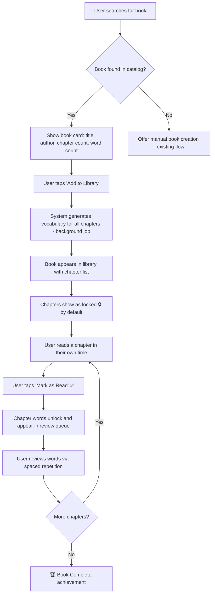
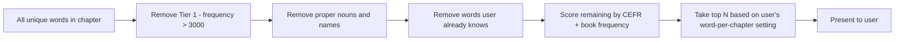
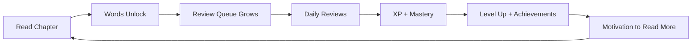

# Auto-Vocabulary-from-Books: Product Design & UX Research

## Executive Summary

This document covers the product design, UX, and legal considerations for adding an auto-vocabulary-from-books feature to ReadLoot. The feature would let users select a book and have the system pre-populate vocabulary words, replacing the current manual-only word entry flow.

The recommended approach is a **hybrid progressive unlock model**: the system pre-generates all vocabulary per chapter at book-add time, but only reveals words from chapters the user marks as "read." This balances convenience with spoiler prevention and fits naturally into the existing XP/achievement system.

Key findings:
- **User flow**: Hybrid progressive unlock is the best fit - pre-generate everything, reveal chapter by chapter
- **Spoiler prevention**: Chapter-gated visibility + generic dictionary definitions (not book-context sentences) is the safest default
- **Word quality**: Use the 3-tier vocabulary model (Tier 2 words are the sweet spot) with CEFR-based difficulty scoring
- **Gamification**: Auto-discovered words should give slightly less XP than manual ones, with new book-completion achievements
- **Legal**: Storing individual sentences from copyrighted books is risky. Use dictionary definitions + word-only lists. Public domain books (Project Gutenberg) are safe for full context.

---

## 1. User Flow: Hybrid Progressive Unlock

```
System pre-generates all words at book-add time
Words are hidden behind chapter gates
User marks chapters as "read" -> words for that chapter unlock
```

- No spoilers - words are locked until you've read the chapter
- Sense of discovery - unlocking words feels like loot drops
- Low friction - one "Mark as Read" button per chapter
- Works offline after initial generation
- Simple to implement - just a reading progress tracker

### User Flow (Mermaid)



---

## 2. Spoiler Prevention Strategies

### Threat Model

Spoilers can leak through:
1. **Context sentences** - "After the protagonist's death in chapter 12..." (highest risk)
2. **Chapter titles** - "The Betrayal" or "Who Killed X" (medium risk)
3. **Word selection itself** - Unusual words that only appear in plot-critical scenes (low risk)
4. **Word ordering** - Seeing words from later chapters reveals narrative progression (low risk)

### Strategy Matrix

| Strategy | Spoiler Protection | User Value | Implementation Cost |
|----------|-------------------|------------|-------------------|
| Chapter-gated visibility | ★★★★★ | ★★★★ | Low |
| Generic dictionary definitions | ★★★★★ | ★★★ | Low |
| Strip character names from context | ★★★ | ★★★★ | Medium |
| User-flagged spoilers | ★★★ | ★★★★★ | Medium |
| Progressive unlock | ★★★★★ | ★★★★★ | Low |

### Recommended Approach (Layered)

**Layer 1 - Chapter gating (mandatory)**
- Words only visible for chapters marked as "read"
- Chapter titles shown but words hidden behind a lock icon
- This alone prevents 90% of spoilers

**Layer 2 - Generic definitions (mandatory)**
- Use dictionary API definitions, NOT sentences from the book
- Example: Show "ephemeral: lasting for a very short time" instead of "The ephemeral peace between the two kingdoms ended when..."
- This eliminates context-based spoilers entirely

**Layer 3 - Chapter title sanitization (nice-to-have)**
- For books in the catalog, store a "safe" chapter title alongside the real one
- Show "Chapter 12" instead of "The Death of Dumbledore" until the chapter is marked as read
- After marking as read, reveal the real chapter title

**Layer 4 - User spoiler flagging (v2)**
- Let users flag a word's context as a spoiler
- Use flags to improve the system over time (crowdsourced spoiler detection)
- Low priority - layers 1-2 handle most cases

### What Existing Apps Do

- **Vocalibrary**: Explicitly markets itself as "spoiler-free" - it shows word lists without book context, lets users check off words they already know
- **WordFlow**: Pre-teaches vocabulary BEFORE reading (predictive learning) - avoids spoilers by design since words are shown without narrative context
- **Kindle Vocabulary Builder**: Only shows words the user has already looked up while reading - inherently spoiler-free since the user has already seen the passage

---

## 3. Word Quality Filtering

### The 3-Tier Vocabulary Model

Academic research (Beck, McKeown & Kucan) classifies words into three tiers:

| Tier | Description | Examples | Learning Value |
|------|-------------|----------|---------------|
| Tier 1 | Basic everyday words | happy, run, big | ❌ Not worth learning |
| Tier 2 | High-frequency academic/literary words | ephemeral, ubiquitous, pragmatic | ✅ Highest learning value |
| Tier 3 | Domain-specific jargon | mitochondria, jurisprudence | ⚠️ Depends on user goals |

**Target: Tier 2 words.** These are the words that appear across many contexts and are most useful for a general vocabulary builder.

### Word Difficulty Scoring

Use a composite score combining:

1. **Word frequency rank** - How common is the word in general English? (Use COCA or BNC frequency lists)
   - Top 3,000 words = Tier 1 (skip)
   - 3,000-10,000 = Tier 2 (target)
   - 10,000+ = Tier 3 (include selectively)

2. **CEFR level mapping** - Map words to Common European Framework levels (A1-C2)
   - A1-A2 = Skip (too basic)
   - B1-B2 = Good candidates
   - C1-C2 = Advanced candidates
   - Tools: English Vocabulary Profile (EVP), CEFR-English-Level-Predictor (open source NLP)

3. **Book-relative frequency** - How many times does the word appear in THIS book?
   - Words appearing 3+ times in a book are likely thematically important
   - Single-occurrence words might be less worth learning

### Adaptive Vocabulary Level

The system should adapt to the user's existing level:

```
New user (0-50 words learned)     -> Show B1-B2 words first
Intermediate (50-200 words)       -> Mix of B2 and C1
Advanced (200+ words)             -> Focus on C1-C2
```

Implementation: Track which words the user marks as "already know" during onboarding or review. Use this to calibrate the difficulty filter.

### Words Per Chapter: The Goldilocks Number

Research on cognitive load and spaced repetition suggests:

| Words per session | Effect |
|-------------------|--------|
| 1-5 | Too few - not engaging enough |
| **8-15** | **Sweet spot - manageable, meaningful progress** |
| 16-25 | Acceptable for motivated learners |
| 25+ | Overwhelming - retention drops sharply |

**Recommendation: Default to 10-12 words per chapter**, with a user-adjustable setting:
- "Light" mode: 5-8 words (casual readers)
- "Standard" mode: 10-12 words (default)
- "Deep" mode: 15-20 words (power users)

The system should pre-generate MORE words than shown, then filter down to the target count based on the user's level and the quality score. This way the catalog has depth, but the user isn't overwhelmed.

### Filtering Pipeline



---

## 4. Gamification Integration

### Current System (from codebase)

The existing gamification system has:
- **XP levels**: Novice (0) -> Page Turner (100) -> Bookworm (500) -> Word Smith (1500) -> Lexicon Lord (5000) -> ReadLoot Master (15000)
- **Streaks**: Daily activity tracking with current/longest streak
- **Achievements**: 10 achievements covering word counts, streaks, reviews, books, mastery
- **XP awards**: Granted for adding words and completing reviews

### How Auto-Populated Words Fit

The key tension: auto-populated words are "free" - the user didn't manually look them up. Should they give the same XP?

**Recommendation: Tiered XP model**

| Action | XP | Rationale |
|--------|-----|-----------|
| Manually add a word (existing) | 10 XP | Full effort - user found, defined, and entered the word |
| Mark chapter as read | 15 XP | Rewards reading progress |
| Review an auto-discovered word correctly | 5 XP | Learning still happened |
| Review a manual word correctly | 5 XP | Same review effort regardless of source |
| Master an auto-discovered word (level 5) | 20 XP | Full mastery is full mastery |
| Complete all words in a chapter | 25 XP (bonus) | Chapter completion bonus |
| Complete all words in a book | 100 XP (bonus) | Major milestone |

The key insight: **don't penalize auto-discovered words during review** - the learning effort is the same. But don't give XP just for unlocking them. XP comes from engagement (reading + reviewing), not from having words in your list.

### New Achievements

Add these to the existing `ACHIEVEMENTS` dict:

```python
# Book completion achievements
"complete_first_book":  ("📕", "Cover to Cover",      "Completed all words in a book"),
"complete_five_books":  ("📚", "Library Complete",     "Completed vocabulary for 5 books"),
"complete_ten_books":   ("🏛️", "Scholar's Archive",    "Completed vocabulary for 10 books"),

# Reading progress achievements  
"read_five_chapters":   ("📖", "Chapter Chaser",       "Marked 5 chapters as read"),
"read_twenty_chapters": ("📚", "Avid Reader",          "Marked 20 chapters as read"),

# Discovery achievements
"discover_hundred":     ("🔍", "Word Explorer",        "Discovered 100 auto-populated words"),
"discover_five_hundred":("🗺️", "Vocabulary Cartographer", "Discovered 500 auto-populated words"),

# Genre/category achievements (if book metadata available)
"three_genres":         ("🎭", "Renaissance Reader",   "Read books from 3 different genres"),

# Speed achievements
"chapter_one_sitting":  ("⚡", "Speed Reader",         "Reviewed all chapter words in one session"),
```

### Reading Progress as a Gamification Dimension

Add a new progress tracking layer alongside XP:

```
📊 Reading Stats
├── Books in library: 3
├── Chapters read: 12 / 45
├── Reading pace: 2.3 chapters/week
├── Words discovered: 156
├── Words mastered: 42
└── Current book: "Sapiens" (Ch 8 / 20)
```

This creates a second axis of engagement beyond just word mastery. Users who read more discover more words, which feeds the review queue, which earns XP. Virtuous cycle.

### Progress Visualization



---

## 5. Legal and Ethical Considerations

### Can You Store/Display Sentences from Copyrighted Books?

**Short answer: It's risky. Don't do it for copyrighted books.**

#### Fair Use Analysis (U.S. Copyright Law, Section 107)

Fair use is evaluated on four factors:

| Factor | Assessment for ReadLoot |
|--------|-------------------------------|
| 1. Purpose and character of use | Educational/transformative - FAVORABLE |
| 2. Nature of the copyrighted work | Creative/literary works - UNFAVORABLE |
| 3. Amount used relative to whole | Individual sentences = small portion - SOMEWHAT FAVORABLE |
| 4. Effect on market value | Could substitute for buying the book if enough context shown - UNFAVORABLE |

The University of North Georgia's fair use guidelines suggest: "an excerpt from any prose work of not more than 1,000 words or 10% of the work, whichever is less." Individual sentences would fall within this, but the guidelines are for classroom use, not commercial apps.

**Key risk**: If the app stores and displays enough sentences from a book, it could be argued to substitute for reading the book itself. This is especially true for non-fiction where individual passages carry standalone value.

#### How Existing Apps Handle This

| App | Approach | Legal Strategy |
|-----|----------|---------------|
| **Kindle Vocabulary Builder** | Only stores words the user looked up while reading a book they purchased | User already owns the book; Amazon has licensing agreements |
| **Vocalibrary** | Stores word lists only, no book sentences | Avoids copyright entirely |
| **WordFlow** | Pre-teaches words with dictionary definitions, not book excerpts | Avoids copyright entirely |
| **VocabSushi** | Uses sentences from public domain classics only | Public domain = no copyright issue |
| **Bookvo** | Uses public domain books and news articles | Public domain + news = safe |

#### Recommended Legal Strategy

**Tier 1: Safe (do this)**
- Store word lists per book/chapter (just the words themselves - not copyrightable)
- Use dictionary API definitions (from free dictionary APIs)
- Use user-provided context sentences (the user types their own)
- Support public domain books with full context (Project Gutenberg has 70,000+ books)

**Tier 2: Probably safe (consider for v2)**
- Store the page/paragraph number where a word appears (reference, not reproduction)
- Let users paste their own highlighted sentences (user-generated content)
- Display a "look up in your copy" prompt instead of showing the sentence

**Tier 3: Risky (avoid)**
- Scraping and storing sentences from copyrighted books
- Displaying book excerpts without licensing agreements
- Building a searchable database of book passages

### Public Domain vs. Copyrighted Books

**Recommendation: Support both, but with different feature sets.**

| Feature | Public Domain Books | Copyrighted Books |
|---------|-------------------|-------------------|
| Word lists per chapter | ✅ | ✅ |
| Dictionary definitions | ✅ | ✅ |
| Original book sentences as context | ✅ | ❌ |
| Chapter summaries | ✅ | ❌ |
| Full text search | ✅ | ❌ |

For the initial catalog, start with public domain books from Project Gutenberg. These are legally safe and include many classics that are great for vocabulary building (Dickens, Austen, Melville, etc.).

For copyrighted books, the system would provide:
- Word lists (just the words, no sentences)
- Dictionary definitions
- A prompt for users to add their own context from their copy

### Data Source Options

| Source | Content | Legal Status | API Available |
|--------|---------|-------------|---------------|
| Project Gutenberg | 70,000+ public domain books | ✅ Free to use | Yes (gutendex.com) |
| Open Library | Metadata for millions of books | ✅ Free metadata | Yes |
| Google Books API | Book metadata + limited previews | ✅ For metadata | Yes |
| Free Dictionary API | Word definitions | ✅ Free to use | Yes |
| WordNet | Word relationships and definitions | ✅ Free to use | Yes (NLTK) |

### Ethical Considerations

1. **Don't replace reading**: The tool should enhance reading, not substitute for it. Never show enough context to make reading the book unnecessary.
2. **Credit authors**: Always show book title and author. Link to purchase options.
3. **User privacy**: Reading habits are sensitive data. Don't share what books users are reading.
4. **Accessibility**: Ensure the feature works for users with different reading speeds and abilities.

---

## 6. Implementation Priorities

### Phase 1: MVP (2-3 weeks)

- [ ] Book catalog with chapter structure (start with 10-20 popular public domain books)
- [ ] Chapter-gated word unlock (mark as read -> words appear)
- [ ] Dictionary definitions via Free Dictionary API
- [ ] Basic word quality filtering (frequency-based, Tier 2 focus)
- [ ] "Mark chapter as read" UI with XP reward
- [ ] 3 new achievements: Cover to Cover, Chapter Chaser, Word Explorer

### Phase 2: Quality & Gamification (2-3 weeks)

- [ ] CEFR-based difficulty scoring
- [ ] Adaptive word count per chapter (Light/Standard/Deep modes)
- [ ] User "already know this" filtering
- [ ] Book completion tracking and achievements
- [ ] Reading pace stats
- [ ] Support for user-uploaded book word lists (copyrighted books)

### Phase 3: Scale & Polish (2-3 weeks)

- [ ] Expand catalog to 100+ public domain books
- [ ] Book search by title/author/genre
- [ ] Community word lists (users share their curated lists for copyrighted books)
- [ ] Spoiler flagging system
- [ ] Genre-based achievements
- [ ] Reading progress visualization (progress bars, streaks)

---

## 7. Open Questions

1. **Where does the word list come from for copyrighted books?** Options: pre-built catalog, user-uploaded, community-shared, or LLM-generated from book metadata.
2. **Should the system integrate with e-readers?** Kindle exports a `vocab.db` file that could be imported. This would bridge the gap for copyrighted books.
3. **How to handle books with no chapter structure?** Some books use parts, sections, or no divisions at all. Need a flexible content structure.
4. **Should there be a social/competitive element?** Leaderboards for "most books completed" or "largest vocabulary" could drive engagement but might also create pressure.

---

## Sources

- [Tier 1, 2 & 3 Vocabulary Guide](https://blog.bedrocklearning.org/literacy-blogs/a-guide-to-tier-1-2-and-3-vocabulary/) - accessed 2026-04-08
- [Vocalibrary - Spoiler-Free Vocabulary Builder](https://apps.apple.com/us/app/vocalibrary/id1088393353) - accessed 2026-04-08
- [WordFlow - Predictive Vocabulary from Books](https://www.wordflowapp.org/blog/learn-words-from-books) - accessed 2026-04-08
- [Kindle Vocabulary Builder Guide](https://www.techbloat.com/how-to-enable-and-use-kindle-vocabulary-builder.html) - accessed 2026-04-08
- [Spaced Repetition: Enhancing Human Learning (PNAS)](https://www.pnas.org/doi/10.1073/pnas.1815156116) - accessed 2026-04-08
- [Spaced Repetition for Efficient Learning (Gwern)](https://gwern.net/spaced-repetition) - accessed 2026-04-08
- [CEFR-English-Level-Predictor (GitHub)](https://github.com/AMontgomerie/CEFR-English-Level-Predictor) - accessed 2026-04-08
- [Predicting CEFR Level of English Texts](https://amontgomerie.github.io/2021/03/14/cefr-level-prediction.html) - accessed 2026-04-08
- [Duolingo Gamification Case Study](https://trophy.so/blog/duolingo-gamification-case-study) - accessed 2026-04-08
- [Stanford Copyright and Fair Use Center](https://fairuse.stanford.edu/overview/fair-use/what-is-fair-use/) - accessed 2026-04-08
- [UNG Fair Use Guidelines for Classroom Copying](https://ung.edu/legal/copyright-compliance/guidelines.php) - accessed 2026-04-08
- [Project Gutenberg - Public Domain Books](https://gutenberg.org/) - accessed 2026-04-08
- [VocabSushi - Public Domain Vocabulary](https://vocabsushi-ios.apps112.com/) - accessed 2026-04-08
- [Progressive Disclosure UX Pattern](https://sparkco.ai/blog/mastering-progressive-disclosure-a-comprehensive-guide) - accessed 2026-04-08
