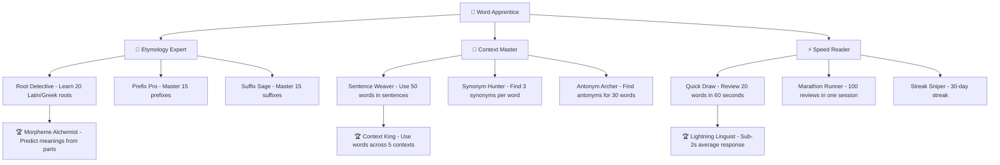
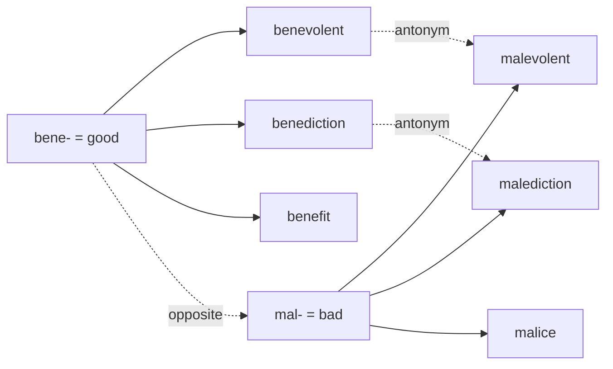
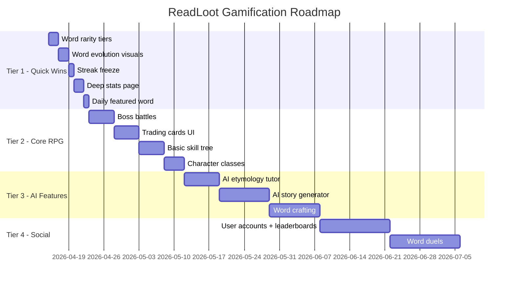

# Gamification Deep Dive - ReadLoot

> Research date: 2026-04-08
> Goal: Transform ReadLoot from a basic XP/levels app into a genuinely addictive vocabulary RPG

## Executive Summary

ReadLoot currently has a solid foundation: XP (10 per word, 5 per review), 6 reader levels, streaks, and 10 achievements. But this is table-stakes gamification - the same stuff every learning app ships on day one.

This research covers five areas that could make the app genuinely fun and addictive:
1. **RPG mechanics** - skill trees, boss battles, word dungeons, character classes, word crafting
2. **Social/competitive features** - duels, guilds, leaderboards, trading cards
3. **AI-powered features** - etymology tutor, mnemonic generation, personalized stories, forgetting prediction
4. **Unique reward systems** - word rarity, word evolution, seasonal events, cosmetic unlocks
5. **Lessons from real apps** - Duolingo, Anki, Forest, Habitica, Pokemon Go

The biggest insight from research: the apps that retain users best don't just reward learning - they make the reward system *the game itself*. Duolingo's streaks weaponize loss aversion. Pokemon Go's collection mechanic triggers completionism. Habitica turns real tasks into RPG consequences. The goal is to make vocabulary building feel like playing a game, not using a study tool.

---

## Current State (What We Have)

| Feature | Implementation | Status |
|---------|---------------|--------|
| XP system | 10 XP per word added, 5 XP per review | ✅ Live |
| Reader levels | 6 tiers: Novice → Vault Master (0-15000 XP) | ✅ Live |
| Streaks | Daily activity tracking, longest streak preserved | ✅ Live |
| Achievements | 10 milestones (word counts, streaks, reviews, books) | ✅ Live |
| Spaced repetition | SM-2 based review engine | ✅ Live |
| Frontend animations | XP popup, level-up overlay, achievement toast | ✅ Live |

### What's Missing

- No branching progression (everyone follows the same linear XP path)
- No social features at all (single-player only)
- No AI integration
- No collection/discovery mechanics
- No time-limited events or FOMO triggers
- No meaningful choices in how you learn
- Achievements are one-dimensional (just "reach X count")

---

## 1. RPG Mechanics That Work for Vocabulary

### 1.1 Skill Trees

Instead of a single linear XP bar, give users branching specialization paths. Research from Prodigy Education shows skill trees increase engagement because they give users *visible choice* and *self-directed progress* - effort feels chosen, not imposed.



**Implementation idea**: Each branch unlocks different review modes and visual themes. Etymology Expert gets word-root breakdowns during review. Context Master gets sentence-completion challenges. Speed Reader gets timed blitz modes.

**Skill points**: Award 1 skill point per level-up. Users choose where to invest. This creates meaningful progression decisions.

### 1.2 Word Crafting (Morpheme Alchemy)

This is the wildest idea and potentially the most educational. Users combine root morphemes to predict or "craft" word meanings.

**How it works**:
- User collects morpheme "ingredients" as they learn words: `bene-` (good), `-dict` (speak), `-ion` (act of)
- Crafting UI lets them combine: `bene` + `dict` + `ion` = "benediction" (a blessing/good speaking)
- Correct combinations award bonus XP and unlock the word as "crafted" (special badge)
- Wrong combinations still teach: "You combined `mal-` + `dict` + `ion` - that's 'malediction' (a curse!)"

**Morpheme sources**: Latin roots (60% of English academic vocabulary), Greek roots (common in science/medicine), Anglo-Saxon roots (everyday words).

**Why it works**: This is active recall + constructive learning. Instead of passively memorizing definitions, users are *building* understanding of how words work. Research shows morphological awareness is one of the strongest predictors of vocabulary growth.

### 1.3 Boss Battles (Vocabulary Dragon)

Timed review sessions framed as combat encounters. Inspired by Dungenious (mobile game combining quiz + dungeon crawl) and boss battle design from game design literature.

**Boss battle structure** (8-beat pattern from game design research):
1. **Warning** - "The Vocabulary Dragon approaches! 20 words stand between you and victory."
2. **Entrance** - Boss appears with HP bar. Each correct answer deals damage.
3. **Attack patterns** - Boss "attacks" with harder word types:
   - Round 1-5: Definition matching (easy)
   - Round 6-10: Fill-in-the-blank sentences (medium)
   - Round 11-15: Etymology/root word questions (hard)
   - Round 16-20: Speed round - 5 seconds per word (boss enrage)
4. **Damage system** - Wrong answers let the boss "hit" you (lose a heart). 3 hearts total.
5. **Victory** - Defeat the boss for massive XP bonus (50-100 XP) + rare loot (cosmetic reward)
6. **Defeat** - Lose all hearts? Boss escapes. Words you missed get flagged for extra review.

**Boss types by book/chapter**:
- Each book's final chapter unlocks a boss battle using all words from that book
- Themed bosses: "The Sapiens Sphinx" for Sapiens vocabulary, "The Gatsby Ghost" for Great Gatsby words
- Weekly rotating world boss that uses your weakest words (AI-selected)

### 1.4 Word Dungeons

Themed word sets presented as explorable dungeon floors. Each floor is a cluster of related words.

**Structure**:
```
📍 The Etymology Catacombs (Latin Roots)
├── Floor 1: Body & Health (corpus, cardiac, dental...) - 10 words
├── Floor 2: Mind & Thought (cogito, mental, cerebral...) - 10 words
├── Floor 3: Power & Rule (regal, dominant, sovereign...) - 10 words
├── 🐉 BOSS: The Latin Lich - all 30 words
└── 🏆 Reward: "Catacombs Conqueror" title + dungeon theme unlock
```

**Dungeon mechanics**:
- **Fog of war**: Words are hidden until you "explore" (review) adjacent ones
- **Treasure chests**: Random bonus XP or cosmetic drops after clearing a floor
- **Traps**: Trick questions using commonly confused words (affect/effect, complement/compliment)
- **Rest points**: After every 5 words, see your progress map and stats
- **Dungeon keys**: Earn keys by maintaining streaks. Each dungeon costs 1 key to enter.

### 1.5 Character Classes

Different learning styles mapped to RPG classes. Each class gets unique review modes and XP bonuses.

| Class | Style | Bonus | Unique Review Mode |
|-------|-------|-------|--------------------|
| 📖 Reader | Context-heavy | +20% XP from sentence exercises | "Story Mode" - words in narrative passages |
| 🔬 Scholar | Etymology-focused | +20% XP from root word exercises | "Dissection Mode" - break words into morphemes |
| 🗣️ Linguist | Pronunciation/usage | +20% XP from audio exercises | "Conversation Mode" - dialogue fill-in-the-blank |
| ⚔️ Warrior | Speed/competition | +20% XP from timed challenges | "Blitz Mode" - rapid-fire reviews |

**Class switching**: Users can switch classes once per week. This encourages trying different learning approaches without commitment anxiety.

---

## 2. Social & Competitive Features

### 2.1 Word Duels

Real-time or asynchronous vocabulary battles between friends.

**Synchronous duel**:
- Both players see the same word simultaneously
- First to tap the correct definition wins the point
- Best of 10 rounds. Winner gets 30 XP, loser gets 10 XP (participation reward)
- Words drawn from the intersection of both players' word lists (fair matchmaking)

**Asynchronous duel** (more practical for MVP):
- Player A completes a 10-word challenge, recording time + accuracy
- Player B gets the same 10 words and tries to beat Player A's score
- Results compared when both finish. Push notification: "You beat Sarah! 9/10 vs 7/10"

**Duel leagues** (borrowed from Duolingo):
- Weekly leagues: Bronze → Silver → Gold → Diamond → Obsidian
- Top 10 in each league promote. Bottom 5 demote.
- League score = total review accuracy * speed bonus that week
- This creates recurring engagement without requiring friends

### 2.2 Guilds / Book Clubs

Shared reading progress with cooperative goals.

**Guild mechanics**:
- 2-10 members per guild
- Shared word pool: all members' words visible to the guild
- **Guild quests**: "Collectively learn 200 words this week" - shared progress bar
- **Guild boss**: Monthly cooperative boss battle using the guild's combined word list
- **Guild leaderboard**: Guilds ranked by total words mastered, not just collected

**Book clubs** (lighter version):
- Create a club around a specific book
- See who's furthest in the book, who's learned the most words
- Discussion prompts: "What did you think 'ephemeral' meant before looking it up?"
- Shared word annotations: members can add context notes to words

### 2.3 Word Trading Cards

This is the Pokemon Go collection mechanic applied to vocabulary. Research shows the TCG market is $15B+ annually - collection mechanics are deeply engaging.

**Card design**:
```
┌─────────────────────────────┐
│ ★★★★☆  RARE                │
│                             │
│    ✨ EPHEMERAL ✨           │
│    /ɪˈfɛm(ə)r(ə)l/        │
│                             │
│  "lasting for a very        │
│   short time"               │
│                             │
│  📖 Origin: Greek           │
│  ephemeros = lasting a day  │
│                             │
│  ⚔️ ATK: 7  🛡️ DEF: 3      │
│  📊 Frequency: 0.0012%     │
│                             │
│  Mastery: ████░░ Level 4    │
│  Found in: Sapiens Ch.3    │
└─────────────────────────────┘
```

**Card stats**:
- **ATK (Attack)**: Word length + syllable count (longer/complex words hit harder in duels)
- **DEF (Defense)**: How well you know it (mastery level). Higher mastery = harder to "steal" in duels
- **Rarity**: Based on real word frequency data (see Section 4.1)
- **Element**: Word origin (Latin, Greek, Germanic, French, etc.)

**Collection mechanics**:
- **Card packs**: Earn a pack every 50 XP. Contains 5 random words from your books.
- **Holographic cards**: Words you've mastered to level 5 get a shiny/holographic treatment
- **Set completion**: Collect all words from a book chapter = set bonus (extra XP + exclusive card back)
- **Trading**: Swap duplicate words with friends (social hook)
- **Card gallery**: Browsable collection with filters by rarity, element, book, mastery

### 2.4 Leaderboards

Multiple leaderboard dimensions to give different player types a chance to shine:

| Leaderboard | Metric | Resets |
|-------------|--------|--------|
| Weekly XP | Total XP earned this week | Weekly |
| Book Champion | Most words from a specific book | Per book |
| Streak Kings | Current active streak | Never |
| Speed Demons | Fastest average review time | Weekly |
| Collectors | Total unique words | Never |
| Accuracy Aces | Highest review accuracy (min 50 reviews) | Monthly |

**Anti-gaming**: Minimum thresholds prevent gaming (e.g., speed leaderboard requires 90%+ accuracy).

---

## 3. AI-Powered Features

### 3.1 AI Etymology Tutor

An AI that explains word origins like a fascinating history teacher, not a dictionary.

**Example interaction**:
```
User learns: "sarcasm"

AI Tutor: "Fun fact - 'sarcasm' literally means 'to tear flesh.'
It comes from Greek 'sarkazein' (σαρκάζειν):
  sarx (flesh) + -azein (to tear)

The Greeks saw cutting remarks as literally ripping
someone apart. Next time someone's sarcastic, remember -
they're verbally tearing your flesh off. 🦴

Related words you might encounter:
  - sarcophagus (flesh + eating = a stone coffin that 'eats' the body)
  - sarcomere (flesh + part = muscle fiber unit)"
```

**Implementation**: Use an LLM (GPT-4/Claude) with a system prompt tuned for etymology storytelling. Cache responses per word to avoid repeated API calls. Pre-generate for common words, on-demand for rare ones.

**Why it works**: Stories are 22x more memorable than facts alone (Stanford research). Connecting words to vivid imagery and history creates durable memory traces.

### 3.2 AI Mnemonic Generator

Auto-generate memory tricks for hard-to-remember words. UMD's SMART system (2024) demonstrated AI-generated keyword mnemonics significantly improve vocabulary retention.

**Mnemonic types**:
1. **Visual keyword**: "UBIQUITOUS = 'You-BIK-with-us' - imagine everyone biking together, they're everywhere (ubiquitous)"
2. **Story mnemonic**: "PERFUNCTORY = 'Per-FUNK-tory' - imagine doing a task while listening to funk music, barely paying attention"
3. **Etymology link**: "CANDIDATE = from Latin 'candidatus' (white-robed) - Roman candidates wore white togas. Picture a politician in a bright white robe."
4. **Rhyme/rhythm**: "GREGARIOUS = 'Greg is various' - Greg talks to various people because he's sociable"

**Personalization**: AI adapts mnemonics based on user's interests (from profile or reading history). A music lover gets music-based mnemonics. A sports fan gets sports analogies.

### 3.3 AI Story Generator

The killer feature: AI creates short stories using your vocabulary words, personalized to your reading level and interests.

**How it works**:
1. Select 5-10 words due for review
2. AI generates a 200-300 word micro-story incorporating all of them
3. Words are highlighted in context. Tap to see definition.
4. After reading, quiz on the words (contextual recall, not just definition matching)

**Example** (using words: ephemeral, ubiquitous, sanguine, perfunctory, gregarious):
> *The gregarious barista gave her usual perfunctory greeting, but today something was different. The ubiquitous coffee shop chatter had died to a whisper. Through the window, cherry blossoms fell in ephemeral pink clouds - here for a moment, then gone. Despite the strange silence, she remained sanguine. Spring always brought change.*

**Difficulty scaling**: AI adjusts story complexity based on the user's reading level and word mastery. Beginner stories use simple sentence structures. Advanced stories use the words in nuanced, secondary-meaning contexts.

### 3.4 AI Difficulty Adaptation (Forgetting Predictor)

Go beyond basic SM-2 spaced repetition. Use ML to predict which specific words a user will forget.

**Signals the AI uses**:
- Time since last review
- Historical accuracy for this word
- Accuracy for similar words (same root, same difficulty tier)
- Time of day patterns (some users perform better in morning vs evening)
- Word characteristics (length, frequency, abstractness, cognate status)
- Interference from similar words (affect/effect, complement/compliment)

**Adaptive review sessions**:
- Instead of fixed intervals, AI dynamically selects the optimal review moment
- "Rescue reviews": Push notification when AI predicts you're about to forget a word
- "Interference alerts": When you learn a new word similar to an existing one, AI flags both for comparison review

**Implementation path**: Start with enhanced SM-2 (add word-difficulty weighting). Graduate to a simple neural model trained on the user's own review history. LingoSnack and Anki's FSRS algorithm are good references.

### 3.5 AI Word Relationship Mapper

Automatically build a visual knowledge graph of how your words connect.



Users can explore their word web, discovering connections they didn't know existed. Tapping a cluster shows all related words and their shared roots.

---

## 4. Unique Reward Systems

### 4.1 Word Rarity Tiers

Assign rarity based on real English word frequency data (Google Ngrams, COCA corpus).

| Tier | Frequency | Color | XP Bonus | Example Words |
|------|-----------|-------|----------|---------------|
| ⬜ Common | Top 5,000 | White/Gray | 1x (10 XP) | important, consider, develop |
| 🟢 Uncommon | 5,001-15,000 | Green | 1.5x (15 XP) | meticulous, pragmatic, eloquent |
| 🔵 Rare | 15,001-30,000 | Blue | 2x (20 XP) | ephemeral, sanguine, perfunctory |
| 🟣 Epic | 30,001-50,000 | Purple | 3x (30 XP) | sesquipedalian, perspicacious, defenestration |
| 🟡 Legendary | 50,000+ | Gold/Animated | 5x (50 XP) | callipygian, petrichor, sonder |

**Discovery excitement**: When you add a word, its rarity is revealed with a card-flip animation. Finding a Legendary word should feel like finding a shiny Pokemon.

**Rarity collection tracker**: "You've found 45/100 Rare words. 12/50 Epic words. 1/20 Legendary words."

**Implementation**: Use word frequency lists (freely available). Map frequency rank to tier. Store tier in the word_entries table.

### 4.2 Word Evolution (Pokemon-style)

Words visually transform as your mastery increases. This is the Pokemon evolution mechanic applied to learning.

**Evolution stages**:
```
Stage 1 (New):        📝 Plain text, gray background
                      "ephemeral - you just met this word"

Stage 2 (Learning):   📘 Blue glow, definition visible
                      "ephemeral - you're getting familiar"

Stage 3 (Practiced):  💫 Sparkle effect, etymology unlocked
                      "ephemeral - you can use it in context"

Stage 4 (Mastered):   ⭐ Gold border, full card art
                      "ephemeral - you own this word"

Stage 5 (Legendary):  👑 Animated holographic, custom art
                      "ephemeral - this word is part of you"
```

**Visual progression**: Each stage gets progressively more elaborate card art. Stage 5 words get unique AI-generated illustrations based on the word's meaning.

**Evolution moments**: When a word levels up, play a satisfying animation (particle effects, sound). This is the dopamine hit that keeps users reviewing.

**"Evolution garden"**: A visual space where all your words live as growing plants/creatures. Stage 1 = seed, Stage 5 = full bloom. Users can see their garden fill up over time.

### 4.3 Cosmetic Themes & Unlocks

Streaks and achievements unlock visual customization. Forest app proves that virtual cosmetics drive engagement even without real-world value.

**Unlockable themes**:
- **Card backs**: Different designs for your word cards (unlocked by book completion)
- **Review backgrounds**: Themed environments (library, forest, space, underwater)
- **Font styles**: Different typography for your word cards
- **Avatar frames**: Borders around your profile picture
- **Streak flames**: Visual streak indicator evolves (🔥 → 🔥🔥 → 💎🔥 → 🌟🔥)
- **Sound packs**: Different audio for correct/incorrect answers

**Streak-gated unlocks**:
| Streak | Unlock |
|--------|--------|
| 7 days | Bronze flame icon |
| 14 days | "Dedicated Reader" title |
| 30 days | Silver card back |
| 60 days | Custom review background |
| 100 days | Gold animated profile frame |
| 365 days | "Vault Legend" title + exclusive theme |

### 4.4 Seasonal Events

Time-limited events create urgency and FOMO (used aggressively by Pokemon Go - limited-time bonuses, rare spawns, seasonal narratives).

**Event ideas**:

**🎃 October - "Haunted Vocabulary"**
- Gothic/horror themed word set (macabre, ghastly, eldritch, sepulchral)
- Spooky dungeon with Halloween boss: "The Phantom Philologist"
- Limited-time card backs and review themes
- 2x XP on horror-genre book words

**📚 January - "New Year, New Words"**
- Resolution challenge: learn 100 new words in January
- Daily word advent calendar (special word revealed each day)
- Community goal: "Can all users collectively learn 1 million words?"

**🌸 April - "Spring Vocabulary Bloom"**
- Nature/growth themed words (verdant, burgeon, efflorescence)
- Evolution garden gets spring decorations
- Bonus XP for reviewing "dormant" words (not reviewed in 30+ days)

**🏆 Monthly - "Word of the Month Challenge"**
- One curated word per month with deep-dive content
- Etymology, usage examples, cultural context, AI-generated story
- Complete all activities for exclusive monthly badge

---

## 5. Lessons from Real Apps

### 5.1 Duolingo - The $12 Billion Habit Machine

**What they do right**:
- **Streaks weaponize loss aversion**: A user with a 100-day streak isn't motivated by reaching 101 - they're *terrified* of seeing the counter reset to zero. Duolingo amplifies this with Streak Freeze (paid feature to preserve streaks). Loss aversion is 2x stronger than gain motivation.
- **Leagues create social pressure**: Weekly leaderboards with promotion/demotion. You don't need friends - the system creates competition with strangers.
- **Variable reward schedules**: Not every lesson gives the same reward. Chest drops, bonus XP, surprise achievements - unpredictability drives engagement.
- **Micro-lessons (5 min)**: Sessions are short enough to fit anywhere. "Just one more lesson" is easy to say.
- **Guilt-tripping notifications**: "These reminders don't seem to be working. We'll stop sending them." Brutal but effective.

**What to steal for ReadLoot**:
- Streak Freeze mechanic (earn or buy with in-app currency)
- Weekly leagues with promotion/demotion
- Variable XP rewards (bonus XP events, lucky word drops)
- Push notifications that reference your streak: "Don't lose your 15-day streak!"

### 5.2 Anki - The Power User's Choice

**What they do right**:
- **Pure spaced repetition**: No gamification fluff - just the most effective review algorithm. FSRS (Free Spaced Repetition Scheduler) is state-of-the-art.
- **Infinite customization**: Card templates, add-ons, custom scheduling. Power users can tune everything.
- **Statistics depth**: Detailed graphs on retention rates, review timing, card maturity. Data nerds love this.
- **Community decks**: Shared decks for common topics. Social without being social.

**What to steal for ReadLoot**:
- Deep statistics page (retention curves, review heatmaps, word difficulty distribution)
- FSRS-inspired scheduling (better than basic SM-2)
- Export/import word lists (community sharing)
- "True retention" metric - show users their actual long-term retention rate

### 5.3 Forest - The Anti-Phone App

**What they do right**:
- **Consequence for failure**: If you leave the app, your tree dies. This is negative reinforcement - the fear of killing your tree keeps you focused.
- **Visual accumulation**: Your forest grows over time. Each tree represents a focus session. The visual garden is deeply satisfying.
- **Real-world impact**: Virtual coins can plant real trees through a partnership. Purpose beyond the game.
- **Simplicity**: One core mechanic, executed perfectly.

**What to steal for ReadLoot**:
- **Word Garden**: Each word is a plant that grows with mastery (see Section 4.2). Neglected words wilt.
- **Consequence for neglect**: Words you don't review start to "fade" visually. Their card art degrades. This creates urgency to review.
- **Real-world connection**: "Your vocabulary helped you read X books this year" - connect learning to tangible outcomes.

### 5.4 Habitica - RPG for Real Life

**What they do right**:
- **HP loss for missed tasks**: Skip your daily review? Your character takes damage. Miss too many? Character dies and loses a level. Real consequences.
- **Classes with abilities**: Warriors, Mages, Healers, Rogues - each with unique skills that affect gameplay.
- **Party quests**: Cooperative boss fights where everyone's daily task completion contributes damage. If someone slacks, the whole party suffers.
- **Pets and mounts**: Collectible creatures hatched from eggs + potions. Pure collection dopamine.
- **Gold economy**: Earn gold from tasks, spend on custom rewards (user-defined: "Watch an episode of TV").

**What to steal for ReadLoot**:
- **HP system**: Start each day with 5 hearts. Miss a scheduled review? Lose a heart. Lose all hearts? Lose some XP. Creates accountability.
- **Party quests for guilds**: Guild members' daily reviews contribute to a shared boss fight
- **Collectible word creatures**: Each word rarity tier hatches a different creature type
- **Custom rewards**: Let users define their own rewards ("After 50 reviews, I get ice cream")

### 5.5 Pokemon Go - Collection Addiction

**What they do right**:
- **Collection completionism**: "Gotta catch 'em all" is the most powerful engagement loop in gaming. Seeing 147/151 in your Pokedex creates an irresistible urge to find the last 4.
- **Rarity tiers**: Common Pokemon are everywhere. Rare ones require effort, luck, or events. The variable rarity creates excitement.
- **Limited-time events**: Seasonal events with exclusive Pokemon. FOMO drives daily engagement.
- **Evolution mechanic**: Collecting candy to evolve Pokemon is a grind, but the evolution animation is so satisfying it justifies the effort.
- **Daily Discovery**: Featured Pokemon scattered across different days, encouraging daily check-ins over binge sessions.

**What to steal for ReadLoot**:
- **Word Pokedex**: A visual catalog of all words you've encountered, with completion percentage per book/category
- **Rarity-based excitement**: Discovering a Legendary word should trigger a special animation and sound
- **Evolution satisfaction**: Word mastery level-ups need to feel as good as a Pokemon evolution
- **Set completion bonuses**: Complete all words from a chapter/book for bonus rewards
- **Daily featured word**: One special word per day with bonus XP and deep-dive content

---

## 6. Implementation Priority Matrix

Ranked by impact vs effort. Start with high-impact, low-effort features.

### Tier 1: Quick Wins (1-2 days each)

| Feature | Impact | Effort | Why First |
|---------|--------|--------|-----------|
| Word rarity tiers | 🔥🔥🔥 | Low | Just a frequency lookup + UI color. Instant excitement boost. |
| Word evolution visuals | 🔥🔥🔥 | Low | CSS/animation changes to existing mastery levels. High dopamine. |
| Streak freeze | 🔥🔥 | Low | One new item in the streak system. Reduces churn from broken streaks. |
| Deep statistics page | 🔥🔥 | Low | Query existing review data. Power users love stats. |
| Daily featured word | 🔥🔥 | Low | One curated word per day with bonus XP. Simple cron + UI. |

### Tier 2: Medium Effort (3-7 days each)

| Feature | Impact | Effort | Why |
|---------|--------|--------|-----|
| Boss battles | 🔥🔥🔥🔥 | Medium | Timed review mode with combat framing. Reuses existing review engine. |
| Word trading cards UI | 🔥🔥🔥🔥 | Medium | Card design + gallery view. Collection mechanic is proven addictive. |
| Skill tree (basic) | 🔥🔥🔥 | Medium | 3 branches, skill points on level-up. New DB table + UI. |
| Character classes | 🔥🔥🔥 | Medium | 4 classes with XP bonuses. Mostly config + UI. |
| Cosmetic unlocks | 🔥🔥 | Medium | Theme system + unlock conditions. Visual variety. |

### Tier 3: Major Features (1-3 weeks each)

| Feature | Impact | Effort | Why |
|---------|--------|--------|-----|
| AI etymology tutor | 🔥🔥🔥🔥🔥 | High | LLM integration. Potentially the most differentiating feature. |
| AI story generator | 🔥🔥🔥🔥🔥 | High | LLM integration + contextual review. Unique in the market. |
| Word crafting (morphemes) | 🔥🔥🔥🔥 | High | Morpheme database + crafting UI. Educationally powerful. |
| Word dungeons | 🔥🔥🔥🔥 | High | Themed word sets + dungeon map UI. Content creation needed. |
| AI forgetting predictor | 🔥🔥🔥 | High | ML model training on review data. Replaces SM-2. |

### Tier 4: Social (requires multi-user infrastructure)

| Feature | Impact | Effort | Why |
|---------|--------|--------|-----|
| Leaderboards | 🔥🔥🔥 | High | Needs user accounts + backend. But proven engagement driver. |
| Word duels | 🔥🔥🔥🔥 | Very High | Real-time or async multiplayer. Complex but viral. |
| Guilds/book clubs | 🔥🔥🔥 | Very High | Group mechanics + shared state. Community building. |
| Seasonal events | 🔥🔥🔥 | Medium | Content creation + time-gating. Needs active user base first. |
| Word trading | 🔥🔥 | Very High | Trading economy. Needs critical mass of users. |

### Recommended Roadmap



---

## 7. Key Psychology Principles at Play

| Principle | Mechanic | App Example |
|-----------|----------|-------------|
| **Loss aversion** | Streak system, HP loss, fading words | Duolingo, Habitica |
| **Variable ratio reinforcement** | Random rarity reveals, loot drops | Pokemon Go, gacha games |
| **Completionism** | Word Pokedex, set completion, achievement grid | Pokemon Go |
| **Social proof** | Leaderboards, guild progress | Duolingo leagues |
| **Endowed progress** | Skill tree with visible next steps | RPG skill trees |
| **Sunk cost** | Long streaks, evolved words, card collections | Duolingo, Forest |
| **Autonomy** | Character classes, skill tree choices | Habitica |
| **Mastery** | Word evolution, boss battles, difficulty scaling | All RPGs |
| **Purpose** | Reading progress, real vocabulary growth stats | Forest (real trees) |

---

## Sources

- [Duolingo Gamification Strategy - nudgenow.com](https://www.nudgenow.com/blogs/duolingo-gamification-strategy) - accessed 2026-04-08
- [Duolingo: The $12 Billion Habit Machine - glauser.com](https://www.glauser.com/thoughts/duolingo-the-12-billion-habit-machine) - accessed 2026-04-08
- [How Duolingo's Streak Mechanic Actually Works - apptitude.io](https://apptitude.io/blog/how-duolingos-streak-mechanic-actually-works/) - accessed 2026-04-08
- [Habitica Gamification Case Study - trophy.so](https://trophy.so/blog/habitica-gamification-case-study) - accessed 2026-04-08
- [Forest Gamification Case Study - trophy.so](https://trophy.so/blog/forest-gamification-case-study) - accessed 2026-04-08
- [Pokemon Go Events Drive Player Engagement - pokemonpricing.com](https://pokemonpricing.com/pokemon-go-events-continue-to-drive-player-engagement/) - accessed 2026-04-08
- [UX of Pokemon Go Case Study - medium.com](https://medium.com/@pedro_ux/pok%C3%A9mon-go-a-case-for-ux-and-psychology-8b6377db573a) - accessed 2026-04-08
- [Skill Trees for Adaptive Learning - Prodigy Engineering](https://medium.com/prodigy-engineering/skill-trees-for-adaptive-learning-729760e5dd00) - accessed 2026-04-08
- [Boss Battle Design and Structure - gamedeveloper.com](https://www.gamedeveloper.com/design/boss-battle-design-and-structure) - accessed 2026-04-08
- [UMD SMART AI Mnemonic Tool - today.umd.edu](https://today.umd.edu/umd-team-creates-ai-tool-to-give-memory-a-hand) - accessed 2026-04-08
- [Personalized Spaced Repetition - upscend.com](https://www.upscend.com/blogs/how-does-personalization-spaced-repetition-improve-retention) - accessed 2026-04-08
- [LingoSnack AI Vocabulary Platform - lingosnack.com](https://lingosnack.com/) - accessed 2026-04-08
- [Using Morphology to Teach Vocabulary - keystoliteracy.com](https://keystoliteracy.com/blog/using-morphology-to-teach-vocabulary/) - accessed 2026-04-08
- [Anki Forums: Gamification Features Discussion](https://forums.ankiweb.net/t/motivational-gamifying-features/59128) - accessed 2026-04-08
- [Mobile TCG Market Report - globenewswire.com](https://www.globenewswire.com/news-release/2026/03/13/3255294/28124/en/81-45-Bn-Mobile-Trading-Card-Game-Markets-Global-Forecast-Report-2025-2032) - accessed 2026-04-08
