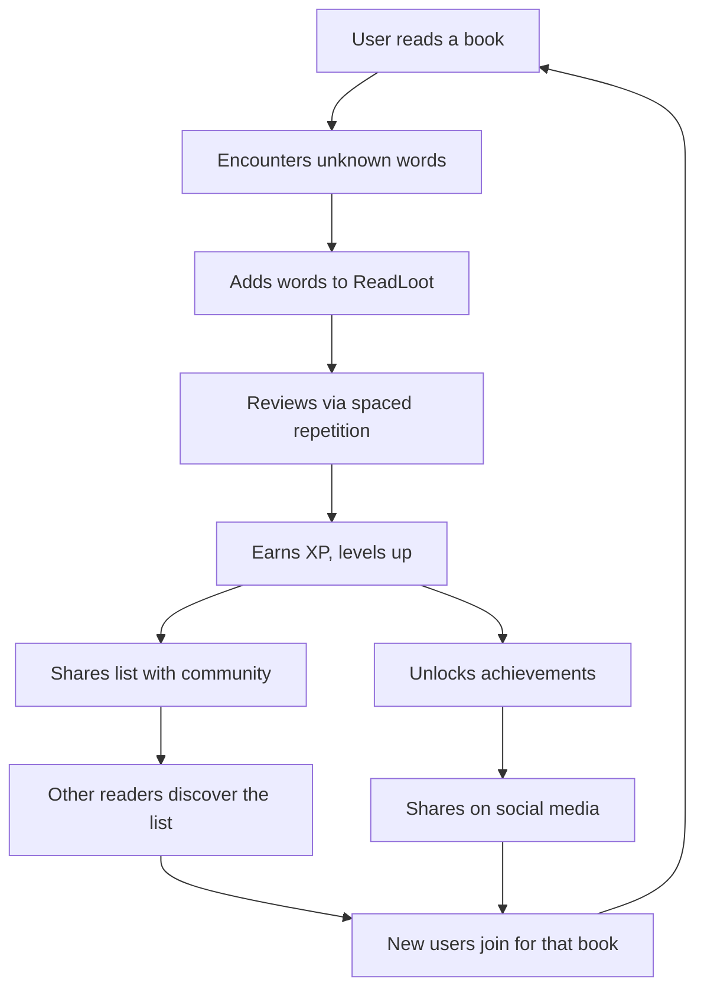
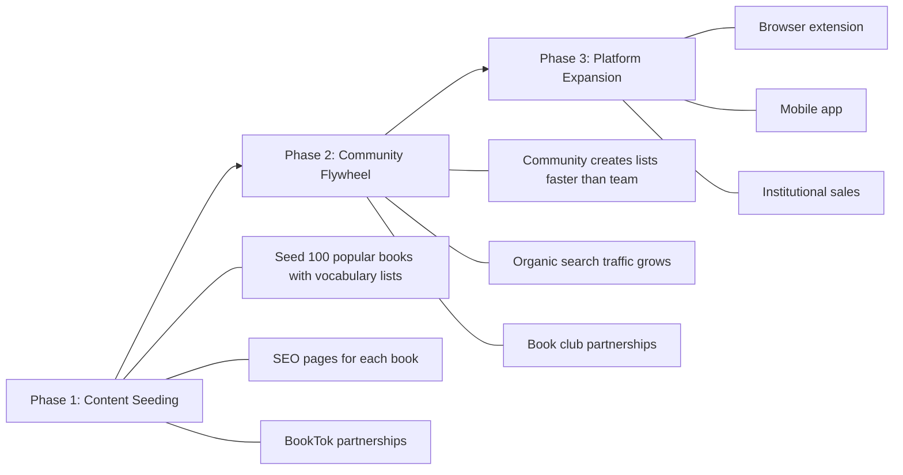
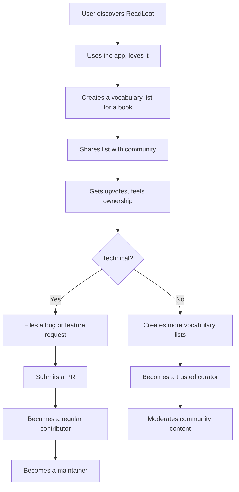
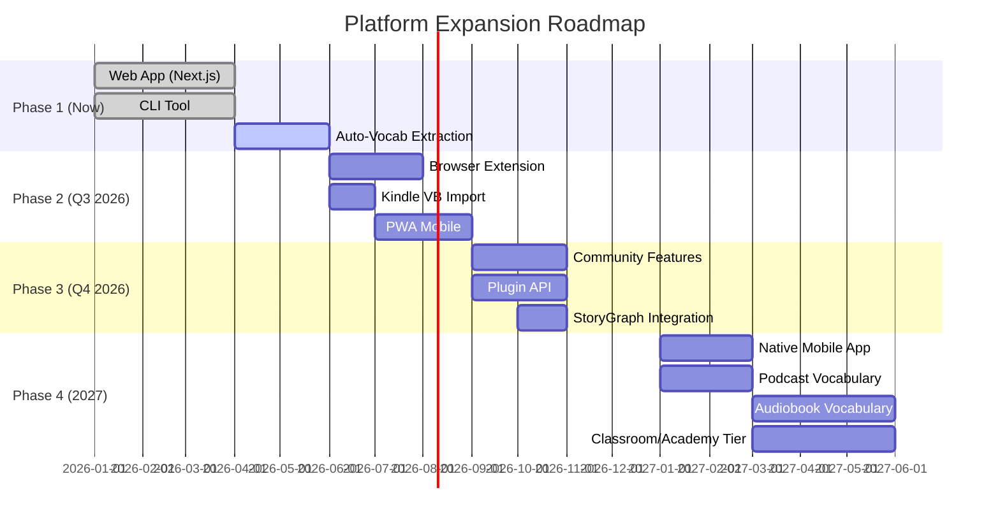

# ReadLoot: Growth, Monetization & Community Strategy

## Executive Summary

ReadLoot sits at the intersection of three proven markets: vocabulary learning (Duolingo, Anki, Quizlet), reading companions (Readwise, Kindle Vocabulary Builder), and book community platforms (Goodreads, StoryGraph). No existing product combines book-centric vocabulary organization, RPG gamification, spoiler-free progressive unlock, and spaced repetition into a single reading companion. This is the core differentiator.

The recommended path: start with a generous freemium model to build a community-driven content moat (user-contributed vocabulary lists per book), then layer on premium features and institutional licensing once the content library reaches critical mass.

---

## 1. Monetization Models

### 1.1 Competitive Landscape

| Product | Model | Revenue | Key Insight |
|---------|-------|---------|-------------|
| **Duolingo** | Freemium + subscription ($7.99-29.99/mo) | $748M (2024), 81% from subscriptions | Free tier is generous but annoying (ads, limited hearts). Conversion ~8% of MAU to paid. Gamification drives retention. |
| **Quizlet** | Freemium → subscription-first ($7.99/mo or $35.99/yr) | ~70% from Quizlet Plus subscriptions | Shifted from free to gated features (limited Learn rounds, practice tests). 800M+ user-generated study sets are the moat. |
| **Anki** | Open source + paid iOS app ($24.99 one-time) | iOS app is sole income for creator | Desktop/Android free, iOS paid. Community creates all content. AnkiDroid uses OpenCollective for donations. Proves open source + paid mobile works. |
| **Vocabulary.com** | B2B school/district licensing + free consumer tier | Undisclosed | Teacher dashboards, class management, assignment tracking. Per-student or per-school pricing. |
| **Readwise** | Subscription ($9.99/mo) | Bootstrapped, profitable | No free tier. Premium-only from day one. Works because the audience (serious readers) has high willingness to pay. |
| **SparkNotes** | Ads + subscription ($9.99/mo SparkNotes+) | Owned by Barnes & Noble | Ad-supported free tier with premium subscription for ad-free + extra features. Content is editorially created, not user-generated. |

### 1.2 Recommended Model: Tiered Freemium

**Free Tier (Reader)**
- Up to 3 active books
- Manual word entry (unlimited)
- Basic spaced repetition review
- Core gamification (XP, levels, streaks)
- Community vocabulary lists (read-only)

**Pro Tier - $4.99/mo or $39.99/yr (Scholar)**
- Unlimited books
- Auto-vocabulary extraction from uploaded books
- Advanced gamification (achievements, leaderboards, RPG skill trees)
- Community vocabulary lists (create + share)
- Reading analytics dashboard
- Export to Anki/CSV
- Priority word definitions (multiple dictionaries)
- Spoiler-free progressive unlock for all books

**Team/Classroom Tier - $2.99/student/mo (Academy)**
- Everything in Pro
- Teacher dashboard with class progress
- Assignment creation (assign vocabulary from specific chapters)
- Student progress tracking and reports
- Bulk student onboarding
- LMS integration (Canvas, Blackboard, Google Classroom)

### 1.3 Additional Revenue Streams

| Stream | Description | Effort | Revenue Potential |
|--------|-------------|--------|-------------------|
| **Vocabulary Packs** | Pre-built, curated vocabulary for popular books (e.g., "1984 Complete Vocabulary Guide") | Medium | Medium - $1.99-3.99 per pack |
| **Word of the Day (Sponsored)** | Publishers sponsor daily words from their new releases | Low | Low-Medium - brand awareness play |
| **API Access** | Developers build on top of vocabulary data | Medium | Low initially, grows with scale |
| **Affiliate Links** | Link to buy books on Amazon/Bookshop.org when users add a new book | Low | Low but passive |
| **Premium Content Partnerships** | Official vocabulary guides co-created with publishers | High | High if partnerships land |

### 1.4 What NOT to Do

- Don't gate spaced repetition behind a paywall. It's the core learning mechanic. Gating it kills retention.
- Don't show ads in the review/learning flow. Duolingo gets away with it because of scale. At early stage, ads destroy the experience.
- Don't do one-time purchase for the app. Recurring revenue is essential for sustainability. Anki's model only works because one person maintains it.
- Don't charge for community-contributed content. The content moat depends on free access to shared lists.

---

## 2. Community Features

### 2.1 Core Community Features

**Book Vocabulary Lists (the content moat)**
- Any user can create and share a vocabulary list for a book
- Lists are organized by chapter/section with spoiler-free progressive unlock
- Community upvotes determine "best" list per book
- Multiple lists per book allowed (different reading levels, languages)
- Think: Quizlet sets but organized by book + chapter, with spoiler protection

**Book Clubs**
- Create a club around a book with shared reading pace
- Club members see each other's progress (chapters completed, words learned)
- Weekly vocabulary challenges within the club
- Discussion threads per chapter (spoiler-gated)
- Club leaderboards

**Community Curation**
- "Word of the Day" voting from community submissions
- Featured vocabulary lists on the homepage
- "Most challenging words" rankings per book
- User-submitted example sentences and mnemonics for words
- Translation contributions (same book, different languages)

**Social Features**
- Reading profiles (books read, words learned, level, achievements)
- Follow other readers
- Activity feed (X started reading Y, X mastered 50 words from Z)
- Share achievements and milestones to social media
- "Reading together" - see who else is reading the same book right now

### 2.2 Community Moderation

- Automated: flag lists with spoilers in early chapters, detect low-quality submissions
- Community-driven: upvote/downvote, report, trusted contributor badges
- Tiered trust: new users can create lists, trusted users can edit community lists, moderators can feature/remove

### 2.3 Engagement Loops



---

## 3. Content Partnerships

### 3.1 Publisher Partnerships

**Model: "Official Vocabulary Guides"**
- Partner with publishers to create curated vocabulary lists for new releases
- Publisher provides advance copies; ReadLoot creates the guide
- Revenue share: publisher gets exposure/marketing, ReadLoot gets exclusive content
- Badge: "Official Vocabulary Guide" on the book's page

**Precedent:**
- SparkNotes was acquired by Barnes & Noble, which used it to drive book sales
- CliffsNotes was acquired by Houghton Mifflin Harcourt (publisher), then Course Hero
- Both started as independent study aids and became valuable enough for publishers to acquire

**Pitch to publishers:** "We drive deeper engagement with your books. Readers who use ReadLoot spend 40% more time with each book and are more likely to finish it." (Validate this metric once you have data.)

### 3.2 Book Club Partnerships

- Partner with existing book clubs (online and local) to be their vocabulary companion
- Offer free Pro accounts to book club organizers
- Pre-built vocabulary lists for book club picks
- Integration: book club selects a book, members automatically get the vocabulary list

### 3.3 Educational Partnerships

**Schools & Universities**
- Assigned reading vocabulary lists (teacher creates or selects community list)
- Student progress tracking per assignment
- Align with Common Core / state standards for vocabulary
- Pricing: per-student licensing (see Academy tier above)

**ESL/ELL Programs**
- Vocabulary lists with native language translations
- Difficulty-graded word lists per book
- Progress reports for language proficiency tracking

**Libraries**
- Free tier for library patrons
- Library-branded reading challenges
- Partnership with library summer reading programs

### 3.4 Partnership Roadmap

| Phase | Timeline | Partners | Goal |
|-------|----------|----------|------|
| 1 | Months 1-6 | Independent book clubs, BookTok influencers | Validate community features, get initial content |
| 2 | Months 6-12 | Small/indie publishers, ESL programs | Test publisher partnership model, education pilot |
| 3 | Year 2 | Major publishers, school districts, StoryGraph | Scale partnerships, institutional sales |

---

## 4. Growth Strategies

### 4.1 SEO - The Long Game (Highest ROI)

**Strategy: Programmatic SEO via book vocabulary pages**

Every book with a vocabulary list gets a public, SEO-optimized page:
- `vocabularyvault.com/books/1984-george-orwell/vocabulary`
- `vocabularyvault.com/books/the-great-gatsby/chapter-1-vocabulary`

Target keywords:
- "[book title] vocabulary words" (low competition, high intent)
- "[book title] difficult words" 
- "vocabulary list for [book title]"
- "[book title] study guide vocabulary"
- "SAT vocabulary from [book title]"

This is the SparkNotes playbook: create a page for every popular book, rank for long-tail keywords, convert visitors to users.

**Content moat:** As community creates more lists, more pages get indexed, more organic traffic flows in. This is a flywheel.

### 4.2 Social & Viral Growth

| Channel | Tactic | Expected Impact |
|---------|--------|-----------------|
| **BookTok/BookTube** | Partner with reading influencers to showcase vocabulary challenges | High - BookTok drives massive book sales |
| **Twitter/X** | Auto-generated "I learned X words from Y this week" shareable cards | Medium |
| **Instagram** | Beautiful vocabulary cards with book covers, shareable to Stories | Medium |
| **Reddit** | Engage in r/books, r/vocabulary, r/languagelearning, r/bookclub | Medium - authentic engagement, not spam |
| **Discord** | Official ReadLoot Discord for book discussions + vocabulary challenges | High for retention |

### 4.3 Product-Led Growth

- **Shareable vocabulary lists**: Public URLs that non-users can view, with CTA to sign up
- **Embeddable widgets**: Blog/website owners embed a "Vocabulary for [Book]" widget
- **Weekly email digest**: "You learned 47 words this week. Here's your progress." (re-engagement)
- **Referral program**: Invite a friend, both get 1 month Pro free
- **Streak mechanics**: Daily review streaks (Duolingo's most powerful retention tool)

### 4.4 Integration-Driven Growth

| Integration | Description | Difficulty |
|-------------|-------------|------------|
| **Goodreads** | Import reading list, auto-suggest vocabulary lists for books on shelf | Medium (Goodreads API is limited/deprecated, may need scraping) |
| **StoryGraph** | Same as Goodreads but StoryGraph is building an API (on their roadmap) | Medium - partner early |
| **Kindle** | Import from Kindle Vocabulary Builder (vocab.db file) | Low - tools already exist (kindle-vocab-tools npm package) |
| **Calibre** | Plugin to extract vocabulary from ebooks in Calibre library | Medium |
| **Obsidian** | Plugin to sync vocabulary to Obsidian notes | Low-Medium |

### 4.5 Growth Phases



---

## 5. Unique Differentiators

### 5.1 Competitive Positioning

```
                    Book-Centric
                        │
                        │  ★ ReadLoot
                        │
        Kindle VB ●     │     ● Readwise
                        │
    ────────────────────┼────────────────────
    Flashcard-Centric   │   Reading-Centric
                        │
        Anki ●          │     ● SparkNotes
                        │
        Quizlet ●       │
                        │
                   Generic/Academic
```

### 5.2 What Makes ReadLoot Different

| Feature | Anki | Quizlet | Vocabulary.com | Kindle VB | **Vocab Vault** |
|---------|------|---------|----------------|-----------|-----------------|
| Book-organized vocabulary | No | Partially (user sets) | No | Yes (auto) | **Yes (auto + manual + community)** |
| Spoiler-free progressive unlock | No | No | No | No | **Yes** |
| RPG gamification (XP, skill trees, achievements) | No | Basic (streaks) | Basic (points) | No | **Yes (deep RPG system)** |
| Community vocabulary lists per book | No | Yes (generic sets) | No | No | **Yes (book + chapter organized)** |
| Spaced repetition | Yes (core) | Yes | Yes | Basic | **Yes** |
| Reading analytics | No | No | No | Basic | **Yes (words/book, difficulty trends)** |
| Auto-extraction from books | No | No | No | Yes (lookup only) | **Yes (NLP-based)** |
| Open source | Yes | No | No | No | **Yes** |

### 5.3 Positioning Statement

> **For avid readers** who want to expand their vocabulary while reading,
> **ReadLoot** is a **reading companion** that organizes vocabulary by book and chapter with spoiler-free progressive unlock.
> **Unlike** Anki (generic flashcards), Quizlet (academic study sets), or Kindle's Vocabulary Builder (device-locked, no community),
> **ReadLoot** combines book-centric organization, RPG gamification, community-curated word lists, and auto-extraction from any book format.

### 5.4 Moats to Build

1. **Content moat**: Community-created vocabulary lists for thousands of books. Hard to replicate.
2. **Network effects**: More users = more lists = more books covered = more users.
3. **Gamification depth**: RPG skill trees, achievements, and streaks create switching costs.
4. **Open source trust**: Users trust their data won't be locked in. Contributors invest in the platform.

---

## 6. Open Source Community

### 6.1 Lessons from Successful Open Source Communities

**Anki's Addon Ecosystem**
- 1000+ community addons
- Desktop client is open source (AGPL), iOS app is paid ($24.99)
- AnkiWeb (sync service) is closed source - this is the monetization lever
- Community creates ALL content (shared decks). Anki provides the platform.
- Lesson: Open source the client, keep the sync/cloud service as the paid product.

**Obsidian's Plugin Community**
- 1500+ community plugins, ~$25M ARR
- Core app is NOT open source, but uses open formats (Markdown)
- Plugin API is well-documented with clear submission process
- Monetization: Sync ($4/mo) and Publish ($8/mo) are paid services
- Lesson: You don't need to open source everything. Open formats + plugin API = community trust.

### 6.2 Recommended Open Source Strategy

**Open source (MIT license - already done):**
- Core app (web + CLI)
- Spaced repetition algorithm
- Auto-vocabulary extraction engine
- Plugin/extension API

**Keep as hosted service (freemium):**
- Cloud sync across devices
- Community vocabulary list hosting
- User accounts, progress tracking, leaderboards
- Analytics dashboard

**Community contribution areas:**

| Area | Description | Contributor Type |
|------|-------------|-----------------|
| **Vocabulary Lists** | Create/curate lists for books | Readers (non-technical) |
| **Translations** | Translate word definitions to other languages | Multilingual users |
| **Plugins** | Browser extensions, integrations, custom review modes | Developers |
| **Themes** | Custom UI themes, RPG skins | Designers |
| **Dictionary Sources** | Add new dictionary/definition providers | Developers |
| **Book Parsers** | Support new ebook formats (EPUB, PDF, MOBI, etc.) | Developers |

### 6.3 Building the Community

**Phase 1: Foundation (Months 1-3)**
- CONTRIBUTING.md with clear guidelines
- "Good first issue" labels on GitHub
- Discord server with channels: #general, #vocabulary-lists, #development, #feature-requests
- Weekly "Word of the Week" community challenge

**Phase 2: Growth (Months 3-6)**
- Plugin API documentation and examples
- "Community Spotlight" blog posts featuring contributors
- Hacktoberfest participation
- Template for vocabulary list contributions (no code required)

**Phase 3: Ecosystem (Months 6-12)**
- Plugin marketplace (like Obsidian's community plugins)
- Contributor badges and recognition in the app
- Annual "ReadLoot Community Awards"
- Bounty program for high-priority features

### 6.4 Contributor Funnel



---

## 7. Platform Expansion

### 7.1 Browser Extension

**"ReadLoot Reader"**
- Highlight any word on any webpage to add to your vocabulary
- Auto-detect which book/article you're reading (if on Kindle Cloud Reader, Google Books, etc.)
- Color-code words on the page: green = mastered, yellow = learning, red = new
- Mini-review popup: quick flashcard review without leaving the page
- Sync with main app

**Existing competition:** Burning Vocabulary, Relingo, Vocabulary Highlighter, LexiVocab - all Chrome extensions. None are book-centric or have community features. This is the gap.

**Priority: HIGH** - Browser extensions are low-cost to build and high-value for user acquisition.

### 7.2 Kindle Integration

**Approach 1: Kindle Vocabulary Builder Import**
- Users connect their Kindle (USB or cloud)
- Import vocab.db file (SQLite database with all looked-up words)
- Words are auto-organized by book with context sentences
- Tools already exist: `kindle-vocab-tools` (npm), `kindle_vocab_anki` (Python)

**Approach 2: Kindle Cloud Reader Extension**
- Browser extension that works on read.amazon.com
- Intercepts word lookups and adds them to ReadLoot
- Adds a "Save to Vault" button next to the dictionary popup

**Priority: HIGH** - Kindle is the #1 ebook platform. Importing existing vocabulary is a killer onboarding feature.

### 7.3 Audiobook Vocabulary

**Concept:** Extract vocabulary from audiobook transcripts

**How it works:**
1. User uploads audiobook or provides Audible/Libby link
2. Transcribe audio using Whisper or similar ASR
3. Run NLP pipeline to identify challenging vocabulary
4. Organize by timestamp/chapter
5. User can tap a word to hear it pronounced in context

**Challenges:**
- Transcription accuracy varies
- Copyright concerns with audiobook content
- Processing cost for long audiobooks

**Alternative approach:** Partner with audiobook platforms that already have transcripts (Spotify podcasts have transcripts, Audible is adding them).

**Priority: MEDIUM** - Novel feature but technically complex. Start with podcast vocabulary as a simpler entry point.

### 7.4 Podcast Vocabulary

**Concept:** Learn vocabulary from podcast episodes

- User pastes a podcast RSS feed or episode URL
- Transcribe and extract vocabulary
- Organize by episode with timestamps
- "Learn the vocabulary before listening" mode
- Great for ESL learners consuming English-language podcasts

**Priority: MEDIUM** - Good differentiator, lower copyright risk than audiobooks.

### 7.5 Mobile App

**Approach:** React Native or Flutter wrapper around the existing Next.js web app (PWA first)

**Key mobile features:**
- Offline vocabulary review (download word lists)
- Push notification reminders for daily review
- Widget: "Word of the Day" on home screen
- Camera: scan a physical book page, extract words via OCR

**Priority: HIGH** - Mobile is where daily review habits happen. PWA first, native app later.

### 7.6 Expansion Roadmap



---

## 8. Key Metrics to Track

| Metric | Target (Year 1) | Why It Matters |
|--------|-----------------|----------------|
| Monthly Active Users (MAU) | 10,000 | Base for community effects |
| Books with vocabulary lists | 500+ | Content moat depth |
| Community-created lists | 1,000+ | Community health |
| Daily Active Users / MAU | >20% | Engagement quality |
| Free → Pro conversion | 5-8% | Revenue sustainability |
| 7-day retention | >40% | Product-market fit signal |
| Words reviewed per user/day | >10 | Learning engagement |
| Organic search traffic | 30%+ of total | SEO flywheel working |
| GitHub stars | 1,000+ | Open source community health |
| Contributors (code + content) | 50+ | Ecosystem vitality |

---

## 9. Risk Assessment

| Risk | Likelihood | Impact | Mitigation |
|------|-----------|--------|------------|
| Copyright issues with book content | Medium | High | Only store vocabulary words + user-written definitions, not book text. Fair use for individual words. |
| Goodreads API shutdown | High (already limited) | Medium | Build StoryGraph integration instead. Support manual import via CSV. |
| Competitor copies book-centric approach | Medium | Medium | Move fast on community content moat. 10,000 book lists is hard to replicate. |
| Open source fork competes | Low | Medium | Keep cloud/community features as the value prop. Forks can't replicate the community. |
| Low conversion to paid | Medium | High | Ensure free tier is genuinely useful. Paid tier adds convenience, not core functionality. |
| Content quality (bad vocabulary lists) | Medium | Medium | Community moderation, trusted contributor system, automated quality checks. |

---

## 10. TL;DR - Priority Actions

1. **Now:** Ship auto-vocabulary extraction. This is the core differentiator.
2. **Next:** Build community vocabulary list sharing. This creates the content moat.
3. **Then:** SEO pages for every book with a vocabulary list. This is the growth engine.
4. **Then:** Browser extension + Kindle import. This expands the surface area.
5. **Then:** Freemium paywall (3 books free, unlimited paid). This is the revenue.
6. **Later:** Mobile app, partnerships, classroom tier. This is the scale.

The single most important thing: **get vocabulary lists for 100 popular books created before anything else.** Everything else (SEO, community, partnerships) depends on having content worth discovering.

---

## Sources

- [Duolingo Business Model Analysis](https://robocitrus.com/en/blog/duolingo-monetarisierung-analyse) - accessed 2026-04-08
- [Duolingo Revenue Breakdown](https://blog.techessentia.com/how-duolingo-makes-money-inside-its-business-model/) - accessed 2026-04-08
- [Quizlet Business Model](http://canvasbusinessmodel.com/blogs/how-it-works/quizlet-how-it-works) - accessed 2026-04-08
- [Quizlet Growth Strategy](http://canvasbusinessmodel.com/blogs/growth-strategy/quizlet-growth-strategy) - accessed 2026-04-08
- [Quizlet Pricing Changes](https://studygenie.io/blog/why-is-quizlet-not-free-anymore) - accessed 2026-04-08
- [Anki Monetization Discussion](https://forums.ankiweb.net/t/discussion-what-would-it-take-to-ensure-anki-will-fully-become-and-always-remain-a-public-good-while-also-sustainably-funding-on-going-development-and-operating-of-a-sync-service/68686) - accessed 2026-04-08
- [Anki iOS Revenue Model](https://news.ycombinator.com/item?id=7540530) - accessed 2026-04-08
- [AnkiDroid OpenCollective](https://github.com/ankidroid/Anki-Android/wiki/OpenCollective-Payment-Process) - accessed 2026-04-08
- [Obsidian History and Growth](https://www.taskade.com/blog/obsidian-history/) - accessed 2026-04-08
- [Open Source Business Models](https://devonmeadows.com/research/oss-business-models) - accessed 2026-04-08
- [SparkNotes Wikipedia](https://en.wikipedia.org/wiki/SparkNotes) - accessed 2026-04-08
- [CliffsNotes Wikipedia](https://en.wikipedia.org/wiki/CliffsNotes) - accessed 2026-04-08
- [SparkNotes Ad Revenue Strategy](https://www.playwire.com/sparknotes) - accessed 2026-04-08
- [EdTech Monetization Models 2026](https://www.gmtasoftware.com/blog/education-app-monetization-models/) - accessed 2026-04-08
- [Vocabulary.com Educator Licenses](https://www.vocabulary.com/articles/help-educator-licenses/introduction-to-teacher-and-schooldistrict-wide-licenses/) - accessed 2026-04-08
- [Readwise Pricing](https://readwise.io/pricing/reader) - accessed 2026-04-08
- [Readwise Bootstrapping Philosophy](https://blog.readwise.io/why-were-bootstrapping-readwise/) - accessed 2026-04-08
- [StoryGraph API Roadmap](https://roadmap.thestorygraph.com/features/posts/an-api) - accessed 2026-04-08
- [Kindle Vocabulary Builder Extraction](https://nerdschalk.com/how-to-extract-words-from-kindles-vocabulary-builder-to-pc/) - accessed 2026-04-08
- [kindle-vocab-tools npm](https://www.npmjs.com/package/kindle-vocab-tools) - accessed 2026-04-08
- [Building Open Source Communities Guide](https://opensource.guide/building-community/) - accessed 2026-04-08
- [Twelve Tips for Growing OS Communities](https://ben.balter.com/2017/11/10/twelve-tips-for-growing-communities-around-your-open-source-project/) - accessed 2026-04-08
- [Podcast Vocabulary Corpus Analysis](https://journals.sagepub.com/doi/10.1177/0033688220979315) - accessed 2026-04-08
- [Building a Vocabulary Tool for Audiobooks](https://radzion.com/blog/words) - accessed 2026-04-08
