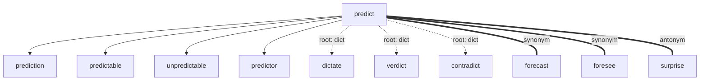
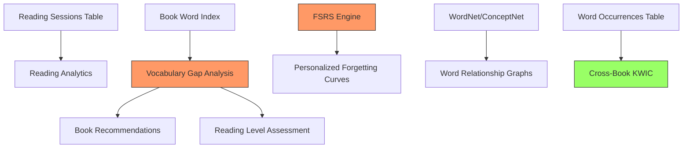

# Smart Reading Companion - Research Document

## Executive Summary

This document researches six features that would transform ReadLoot from a vocabulary tracker into an intelligent reading companion. Each section covers the theory, algorithms, data sources, and concrete implementation approach for the existing SQLite + Python + Next.js stack.

**Current state**: ReadLoot tracks words per book/chapter with mastery levels 0-5, SM-2 spaced repetition (intervals: 1,1,3,7,14,30 days), review history (correct/incorrect per word), XP, streaks. SQLite with FTS5 search. Auto-vocab feature in progress.

**Key findings**:
- FSRS algorithm (19 parameters, DSR memory model) would replace SM-2 with 20-30% fewer reviews for same retention
- Vocabulary gap analysis is feasible with word frequency lists + set difference against user's known words
- WordNet (NLTK) provides synonyms/antonyms/hypernyms; ConceptNet adds broader semantic links; MorphoLex covers word families
- KWIC concordance is straightforward to build on existing FTS5 infrastructure
- CEFR level estimation maps vocabulary size to proficiency bands (A1: ~700 words through C2: ~16,000 words)
- The i+1 hypothesis suggests recommending books where 95-98% of words are already known

---

## Table of Contents

1. [Reading Analytics](#1-reading-analytics)
2. [Smart Word Recommendations & Vocabulary Gap Analysis](#2-smart-word-recommendations--vocabulary-gap-analysis)
3. [Word Relationship Graphs](#3-word-relationship-graphs)
4. [Contextual Learning (Cross-Book KWIC)](#4-contextual-learning-cross-book-kwic)
5. [Forgetting Curve Prediction (FSRS)](#5-forgetting-curve-prediction-fsrs)
6. [Reading Level Assessment](#6-reading-level-assessment)
7. [Implementation Priority & Dependencies](#7-implementation-priority--dependencies)

---

## 1. Reading Analytics

### What to Track

| Metric | How to Compute | Storage |
|--------|---------------|---------|
| Words added per session | Count inserts between session start/end | `reading_sessions` table |
| Vocabulary acquisition rate | Words added / days active per book | Derived from `word_entries.date_added` |
| Reading patterns (time of day) | Timestamp of word additions and reviews | Already in `date_modified`, add time precision |
| Session length | Time between first and last action in a session | `reading_sessions` table |
| Book completion prediction | (total chapters - completed chapters) * avg days per chapter | Derived from existing data |
| Vocabulary density per book | Unique words tracked / total chapters | Derived query |

### Schema Additions

```sql
CREATE TABLE IF NOT EXISTS reading_sessions (
    id INTEGER PRIMARY KEY AUTOINCREMENT,
    book_id INTEGER REFERENCES books(id),
    started_at TEXT NOT NULL DEFAULT (datetime('now')),
    ended_at TEXT,
    words_added INTEGER NOT NULL DEFAULT 0,
    words_reviewed INTEGER NOT NULL DEFAULT 0
);

-- Add hour tracking to review_history (currently only stores date)
-- Migrate: ALTER TABLE review_history ADD COLUMN review_time TEXT;
```

### Key Algorithms

**Vocabulary acquisition rate**: Simple linear regression over `(day_number, cumulative_word_count)` per book. The slope gives words/day. Can predict "at this rate, you'll finish in X days."

**Reading speed estimation**: Since we track chapters and dates, we can compute:
```python
avg_days_per_chapter = (last_chapter_date - first_chapter_date) / chapters_completed
estimated_completion = remaining_chapters * avg_days_per_chapter
```

**Pattern detection**: Group `review_history` and `word_entries.date_added` by hour-of-day to find peak learning times. Simple histogram, no ML needed.

### Visualization Ideas

- Heatmap calendar (like GitHub contributions) showing daily word activity
- Line chart of cumulative vocabulary per book over time
- Bar chart comparing vocabulary density across books
- "Reading streak" visualization tied to existing streak system


---

## 2. Smart Word Recommendations & Vocabulary Gap Analysis

### The Core Idea

Compare a user's known vocabulary against a book's word list to estimate:
1. How many new words they'd encounter
2. What percentage of the book they can already understand
3. Whether the book is at the right difficulty level (i+1)

### Research: Text Coverage Thresholds

From Hirsh & Nation and Hu & Nation's research on reading comprehension:

| Coverage | Experience | Recommendation |
|----------|-----------|----------------|
| 98%+ | Comfortable independent reading | Too easy for learning |
| 95-98% | 1 unknown word per 20-50 words | **Ideal for i+1 learning** |
| 90-95% | 1 unknown word per 10-20 words | Challenging but possible |
| < 90% | Frustration level | Too difficult |

The sweet spot for vocabulary acquisition is 95-98% coverage - the reader understands enough context to infer new word meanings.

### Algorithm: Vocabulary Gap Analysis

```python
def vocabulary_gap_analysis(user_known_words: set, book_word_list: set) -> dict:
    """Compare user vocabulary against a book's word list.
    
    Args:
        user_known_words: Set of words the user has mastered (mastery >= 3)
        book_word_list: Set of unique words in the target book
    
    Returns:
        Dict with coverage stats and new word predictions
    """
    known_in_book = user_known_words & book_word_list
    unknown_in_book = book_word_list - user_known_words
    
    coverage = len(known_in_book) / len(book_word_list) if book_word_list else 0
    
    return {
        "total_unique_words": len(book_word_list),
        "known_words": len(known_in_book),
        "new_words": len(unknown_in_book),
        "coverage_percent": coverage * 100,
        "difficulty_rating": classify_difficulty(coverage),
        "new_word_list": sorted(unknown_in_book),
    }

def classify_difficulty(coverage: float) -> str:
    if coverage >= 0.98: return "too_easy"
    if coverage >= 0.95: return "ideal"       # i+1 zone
    if coverage >= 0.90: return "challenging"
    return "too_difficult"
```

### Building Book Word Lists

Two approaches:

**Approach A - Pre-indexed books (recommended for auto-vocab)**:
When a book's markdown files are imported, extract and store all unique words:

```sql
CREATE TABLE IF NOT EXISTS book_word_index (
    id INTEGER PRIMARY KEY AUTOINCREMENT,
    book_id INTEGER NOT NULL REFERENCES books(id),
    word TEXT NOT NULL,
    frequency INTEGER NOT NULL DEFAULT 1,
    UNIQUE(book_id, word)
);
```

**Approach B - On-demand analysis**:
Parse markdown files at query time. Slower but no storage overhead.

### Defining "Known Words"

The user's known vocabulary should include:
1. Words at mastery level >= 3 (reviewed and retained)
2. Optionally: common English words (top 3000 from frequency lists) assumed known
3. Words from completed books where mastery >= 2

```sql
-- Get user's known vocabulary
SELECT DISTINCT LOWER(word) FROM word_entries WHERE mastery_level >= 3
UNION
SELECT word FROM common_vocabulary;  -- pre-loaded frequency list
```

### Book Recommendation Engine

```python
def recommend_next_books(conn, user_id, candidate_books) -> list:
    """Rank candidate books by learning potential.
    
    Best books are those in the i+1 zone (95-98% coverage)
    with the most useful new vocabulary.
    """
    known_words = get_user_known_words(conn)
    
    recommendations = []
    for book in candidate_books:
        book_words = get_book_word_index(conn, book.id)
        gap = vocabulary_gap_analysis(known_words, book_words)
        
        # Score: prefer books in the ideal zone
        # Penalize too-easy and too-hard books
        if 0.95 <= gap["coverage_percent"] / 100 <= 0.98:
            score = 100 - abs(gap["coverage_percent"] - 96.5)
        elif gap["coverage_percent"] / 100 >= 0.90:
            score = 50 - (0.95 - gap["coverage_percent"] / 100) * 100
        else:
            score = 10
        
        recommendations.append({
            "book": book,
            "gap_analysis": gap,
            "score": score,
        })
    
    return sorted(recommendations, key=lambda r: r["score"], reverse=True)
```

### Data Sources for Word Frequency Lists

- **English word frequency**: Use the top 5000 words from the Corpus of Contemporary American English (COCA) or British National Corpus (BNC). These are freely available.
- **Academic Word List (AWL)**: 570 word families common in academic texts. Useful for non-fiction readers.
- **Pre-built lists**: The `wordfreq` Python package provides frequency data for 40+ languages.


---

## 3. Word Relationship Graphs

### Goal

Build a knowledge graph of the user's vocabulary showing connections: synonyms, antonyms, word families (predict/prediction/predictable), and etymology trees (Latin roots connecting words).

### Data Sources

#### WordNet (via NLTK)

WordNet is a lexical database that groups English words into synonym sets (synsets) linked by semantic relations.

| Relation | Example | API |
|----------|---------|-----|
| Synonyms | happy -> glad, joyful | `synset.lemma_names()` |
| Antonyms | happy -> sad | `lemma.antonyms()` |
| Hypernyms (is-a parent) | dog -> canine -> animal | `synset.hypernyms()` |
| Hyponyms (is-a child) | animal -> dog, cat | `synset.hyponyms()` |
| Meronyms (part-of) | tree -> trunk, branch | `synset.part_meronyms()` |
| Holonyms (whole-of) | wheel -> car | `synset.member_holonyms()` |

```python
from nltk.corpus import wordnet as wn

def get_word_relationships(word: str) -> dict:
    synsets = wn.synsets(word)
    if not synsets:
        return {}
    
    primary = synsets[0]  # most common sense
    
    synonyms = set()
    antonyms = set()
    for syn in synsets:
        for lemma in syn.lemmas():
            synonyms.add(lemma.name().replace('_', ' '))
            for ant in lemma.antonyms():
                antonyms.add(ant.name().replace('_', ' '))
    
    synonyms.discard(word)
    
    return {
        "synonyms": sorted(synonyms),
        "antonyms": sorted(antonyms),
        "hypernyms": [h.lemma_names()[0] for h in primary.hypernyms()],
        "hyponyms": [h.lemma_names()[0] for h in primary.hyponyms()[:10]],
        "definition": primary.definition(),
    }
```

**Install**: `pip install nltk` then `nltk.download('wordnet')`
**Size**: ~12MB download, runs entirely offline.

#### ConceptNet

ConceptNet is a broader knowledge graph with 34 relation types across multiple languages. It goes beyond WordNet with common-sense relationships.

| Relation | Example |
|----------|---------|
| RelatedTo | book -> reading, library |
| UsedFor | pen -> writing |
| CapableOf | bird -> fly |
| HasProperty | ice -> cold |
| DerivedFrom | prediction -> predict |
| EtymologicallyRelatedTo | democracy -> demos (Greek) |

**API**: `http://api.conceptnet.io/c/en/{word}` (free, rate-limited)
**Offline**: Full dump available (~5GB), but API is sufficient for per-word lookups.

```python
import requests

def get_conceptnet_relations(word: str, limit: int = 20) -> list:
    url = f"http://api.conceptnet.io/c/en/{word}?limit={limit}"
    resp = requests.get(url)
    data = resp.json()
    
    relations = []
    for edge in data.get("edges", []):
        relations.append({
            "relation": edge["rel"]["label"],
            "start": edge["start"]["label"],
            "end": edge["end"]["label"],
            "weight": edge["weight"],
        })
    return relations
```

#### MorphoLex (Word Families / Morphological Analysis)

MorphoLex is a derivational morphological database covering 70,000 English words. It breaks words into morphemes:

- `predict` -> `pre-` (prefix: before) + `dict` (root: say)
- `prediction` -> `pre-` + `dict` + `-ion` (suffix: noun)
- `predictable` -> `pre-` + `dict` + `-able` (suffix: capable of)
- `unpredictable` -> `un-` + `pre-` + `dict` + `-able`

**Source**: GitHub `hugomailhot/MorphoLex-en` (CSV, ~3MB)

#### Etymology Data

For etymology trees connecting words through Latin/Greek roots:

- **Wiktionary API**: Has etymology sections for most English words. Parse the "Etymology" section.
- **Etymological WordNet**: Academic dataset linking words to their etymological origins across languages.
- **Manual root database**: Build a curated table of ~200 common Latin/Greek roots:

```sql
CREATE TABLE IF NOT EXISTS word_roots (
    id INTEGER PRIMARY KEY AUTOINCREMENT,
    root TEXT NOT NULL,
    origin_language TEXT NOT NULL,  -- 'Latin', 'Greek', 'Germanic'
    meaning TEXT NOT NULL,
    examples TEXT  -- comma-separated
);

CREATE TABLE IF NOT EXISTS word_root_links (
    word_id INTEGER REFERENCES word_entries(id),
    root_id INTEGER REFERENCES word_roots(id),
    PRIMARY KEY (word_id, root_id)
);
```

Example roots:
| Root | Origin | Meaning | Words |
|------|--------|---------|-------|
| dict | Latin | say, speak | predict, dictate, verdict, contradict |
| graph | Greek | write | biography, photograph, autograph |
| port | Latin | carry | transport, export, import, portable |
| spec | Latin | look, see | inspect, spectacle, perspective |

### Graph Visualization

Use a force-directed graph (D3.js or vis.js in the frontend):



### Schema for Relationship Cache

```sql
CREATE TABLE IF NOT EXISTS word_relationships (
    id INTEGER PRIMARY KEY AUTOINCREMENT,
    word TEXT NOT NULL,
    related_word TEXT NOT NULL,
    relation_type TEXT NOT NULL,  -- 'synonym', 'antonym', 'hypernym', 'word_family', 'etymology'
    source TEXT NOT NULL,         -- 'wordnet', 'conceptnet', 'morpholex'
    weight REAL DEFAULT 1.0,
    UNIQUE(word, related_word, relation_type)
);
```

Cache relationships on first lookup, refresh periodically. This avoids repeated API calls and enables offline use.


---

## 4. Contextual Learning (Cross-Book KWIC)

### What is KWIC?

KWIC (Key Word In Context) is a concordance display format that shows a target word centered in a fixed-width window with surrounding context on both sides. It's the standard tool in corpus linguistics for studying how words are used.

Example KWIC display for "ephemeral":
```
Book A, Ch 3:  ...the beauty of the sunset was ephemeral, lasting only minutes before...
Book B, Ch 7:  ...social media creates an      ephemeral culture where nothing persists...
Book C, Ch 1:  ...unlike stone monuments, these ephemeral structures were built to decay...
```

### How Concordance Tools Work

1. **Index phase**: Build an inverted index mapping each word to its positions in the corpus (book, chapter, character offset)
2. **Query phase**: Look up the word, retrieve positions, extract surrounding context window
3. **Display phase**: Align the keyword in the center, show left/right context

### Implementation for ReadLoot

The existing `word_entries` table already stores `context` (the sentence where the word was found). This is the simplest concordance - one context per word per chapter.

For richer cross-book tracking, we need to store ALL occurrences, not just the one the user saved:

```sql
CREATE TABLE IF NOT EXISTS word_occurrences (
    id INTEGER PRIMARY KEY AUTOINCREMENT,
    word TEXT NOT NULL,
    book_id INTEGER NOT NULL REFERENCES books(id),
    chapter_id INTEGER NOT NULL REFERENCES chapters(id),
    context_sentence TEXT NOT NULL,
    char_offset INTEGER,  -- position in the chapter file
    UNIQUE(word, chapter_id, char_offset)
);

-- Index for fast lookups
CREATE INDEX IF NOT EXISTS idx_word_occurrences_word 
    ON word_occurrences(LOWER(word));
```

### Building the Occurrence Index

When a book is imported (or during auto-vocab scanning), extract all sentences containing tracked words:

```python
import re

def extract_word_occurrences(text: str, tracked_words: set) -> list:
    """Find all sentences containing any tracked word.
    
    Args:
        text: Full chapter text
        tracked_words: Set of words to look for (lowercase)
    
    Returns:
        List of (word, sentence, char_offset) tuples
    """
    # Split into sentences (simple approach)
    sentences = re.split(r'(?<=[.!?])\s+', text)
    
    occurrences = []
    offset = 0
    for sentence in sentences:
        words_in_sentence = set(
            re.findall(r'\b[a-zA-Z]+\b', sentence.lower())
        )
        matches = tracked_words & words_in_sentence
        for word in matches:
            occurrences.append((word, sentence.strip(), offset))
        offset += len(sentence) + 1
    
    return occurrences
```

### Leveraging Existing FTS5

The current `word_entries_fts` virtual table already supports full-text search. For cross-book context, we can query:

```sql
-- Find all contexts where a word appears across books
SELECT w.word, w.context, b.name AS book_name, c.name AS chapter_name
FROM word_entries w
JOIN books b ON w.book_id = b.id
JOIN chapters c ON w.chapter_id = c.id
WHERE LOWER(w.word) = LOWER(?)
ORDER BY b.name, c.chapter_number;
```

This already works for words the user has explicitly added. The `word_occurrences` table extends this to ALL appearances, not just user-tracked ones.

### KWIC Display Component

Frontend component showing aligned contexts:

```typescript
interface KWICEntry {
  bookName: string;
  chapterName: string;
  leftContext: string;   // ~40 chars before the word
  keyword: string;
  rightContext: string;  // ~40 chars after the word
}

// Display: left-aligned right context, center-aligned keyword
// "...sunset was  [ephemeral]  lasting only..."
// "...creates an  [ephemeral]  culture where..."
```

### Cross-Book Insights

Beyond raw concordance, derive insights:
- **Semantic drift**: Does the word mean different things in different books?
- **Collocations**: What words frequently appear near this word? (e.g., "ephemeral" often appears with "beauty", "nature", "fleeting")
- **Usage frequency**: Which books use this word most? Indicates genre/topic associations.


---

## 5. Forgetting Curve Prediction (FSRS)

### Current State: SM-2

ReadLoot currently uses a simplified SM-2 with fixed intervals:

```python
# From review_engine.py
REVIEW_INTERVALS = {0: 1, 1: 1, 2: 3, 3: 7, 4: 14, 5: 30}
```

On correct answer: mastery += 1, schedule next review at `REVIEW_INTERVALS[new_mastery]` days.
On incorrect: mastery = 1, schedule tomorrow.

**Limitations**: No personalization. Everyone gets the same intervals. No concept of word difficulty. Binary correct/incorrect (no "hard" or "easy" grades).

### FSRS: Free Spaced Repetition Scheduler

FSRS is a modern algorithm based on the DSR (Difficulty, Stability, Retrievability) memory model. It uses 19 learned parameters and achieves 20-30% fewer reviews than SM-2 for the same retention rate.

#### The Three Components

| Component | Symbol | Range | Meaning |
|-----------|--------|-------|---------|
| Retrievability | R | [0, 1] | Probability of recalling the word right now |
| Stability | S | [0, +inf] | Days for R to decay from 1.0 to 0.9 |
| Difficulty | D | [1, 10] | How hard this word is to remember |

#### Core Equations

**Forgetting curve** (how R decays over time):
```
R(t) = (1 + F * t/S) ^ C
where F = 19/81, C = -0.5
```

**Optimal review interval** (when to review next):
```
I(R_desired) = (S / F) * (R_desired^(1/C) - 1)
```

For desired retention of 0.9 (90%), the interval equals the stability value.

**Stability update on success**:
```
S' = S * alpha
alpha = 1 + (11-D) * S^(-w9) * (e^(w10*(1-R)) - 1) * hard_penalty * easy_bonus * e^(w8)
```

**Stability update on failure**:
```
S' = min(S_fail, S)
S_fail = D^(-w12) * ((S+1)^w13 - 1) * e^(w14*(1-R)) * w11
```

**Difficulty update**:
```
D' = w7 * D0(easy) + (1 - w7) * (D + delta_D * (10-D)/9)
delta_D = -w6 * (G - 3)
```

#### Default Parameters (FSRS v5)

```python
W = [
    0.40255, 1.18385, 3.173, 15.69105,  # w0-w3: initial stability per grade
    7.1949,                                # w4: initial difficulty on failure
    0.5345,                                # w5: initial difficulty scaling
    1.4604,                                # w6: difficulty delta scaling
    0.0046,                                # w7: difficulty mean reversion
    1.54575,                               # w8: stability success scaling
    0.1192,                                # w9: stability saturation
    1.01925,                               # w10: retrievability effect
    1.9395,                                # w11: failure stability scaling
    0.11,                                  # w12: failure difficulty effect
    0.29605,                               # w13: failure stability effect
    2.2698,                                # w14: failure retrievability effect
    0.2315,                                # w15: hard penalty
    2.9898,                                # w16: easy bonus
    0.51655,                               # w17: (short-term stability)
    0.6621,                                # w18: (short-term stability)
]
```

#### Python Implementation

```python
from dataclasses import dataclass
from enum import IntEnum
import math

class Grade(IntEnum):
    FORGOT = 1
    HARD = 2
    GOOD = 3
    EASY = 4

F = 19.0 / 81.0
C = -0.5

@dataclass
class CardState:
    stability: float = 0.0
    difficulty: float = 0.0
    last_review_days_ago: float = 0.0

def retrievability(t: float, s: float) -> float:
    return (1.0 + F * (t / s)) ** C

def interval(desired_retention: float, s: float) -> float:
    return (s / F) * (desired_retention ** (1.0 / C) - 1.0)

def initial_stability(grade: Grade) -> float:
    return W[grade.value - 1]

def initial_difficulty(grade: Grade) -> float:
    g = float(grade.value)
    return max(1.0, min(10.0, W[4] - math.exp(W[5] * (g - 1.0)) + 1.0))

def update_stability(d: float, s: float, r: float, g: Grade) -> float:
    if g == Grade.FORGOT:
        d_f = d ** (-W[12])
        s_f = (s + 1.0) ** W[13] - 1.0
        r_f = math.exp(W[14] * (1.0 - r))
        return min(d_f * s_f * r_f * W[11], s)
    else:
        t_d = 11.0 - d
        t_s = s ** (-W[9])
        t_r = math.exp(W[10] * (1.0 - r)) - 1.0
        h = W[15] if g == Grade.HARD else 1.0
        b = W[16] if g == Grade.EASY else 1.0
        alpha = 1.0 + t_d * t_s * t_r * h * b * math.exp(W[8])
        return s * alpha

def update_difficulty(d: float, g: Grade) -> float:
    delta = -W[6] * (float(g.value) - 3.0)
    dp = d + delta * ((10.0 - d) / 9.0)
    return max(1.0, min(10.0, W[7] * initial_difficulty(Grade.EASY) + (1.0 - W[7]) * dp))
```

### Duolingo's Half-Life Regression (HLR)

An alternative approach from Duolingo's research (Settles & Meeder, 2016):

**Model**: `p(recall) = 2^(-delta / h)` where:
- `delta` = time since last practice (days)
- `h` = half-life of the memory (learned per word per user)

**Half-life regression**: `h = 2^(theta . x)` where:
- `theta` = model weights (learned from data)
- `x` = feature vector including: number of past reviews, number of correct/incorrect, time since last review, word difficulty features

**Key insight**: HLR learns per-word, per-user half-lives from actual review data. It reduced prediction error by 45% compared to baselines in Duolingo's study.

**Comparison with FSRS**:

| Aspect | SM-2 (current) | HLR (Duolingo) | FSRS |
|--------|---------------|-----------------|------|
| Personalization | None | Per-word, per-user | Per-card (via D, S) |
| Parameters | 0 (fixed intervals) | Learned from data | 19 defaults, trainable |
| Grade options | Binary (correct/wrong) | Binary | 4 levels |
| Training data needed | None | Large dataset | Works with defaults, improves with data |
| Implementation complexity | Trivial | Moderate (needs ML) | Moderate (pure math) |

### Migration Path: SM-2 to FSRS

**Phase 1**: Add FSRS fields to schema, keep SM-2 as fallback
```sql
ALTER TABLE word_entries ADD COLUMN fsrs_stability REAL;
ALTER TABLE word_entries ADD COLUMN fsrs_difficulty REAL;
ALTER TABLE review_history ADD COLUMN grade INTEGER DEFAULT 3;  -- 1-4 scale
```

**Phase 2**: For new words, use FSRS with default parameters. For existing words, initialize stability from current mastery level:
```python
# Bootstrap FSRS from existing SM-2 state
MASTERY_TO_STABILITY = {0: 0.4, 1: 1.2, 2: 3.2, 3: 7.0, 4: 15.7, 5: 30.0}
```

**Phase 3**: After collecting enough review data (~100+ reviews), train personalized parameters using the FSRS optimizer.

### Personalized Forgetting Curves

With FSRS, each word has its own forgetting curve based on its stability and difficulty. The app can show:
- "You'll forget 'ephemeral' in ~3 days" (based on current stability)
- "Your hardest words" (sorted by difficulty D)
- "Words at risk" (R < 0.7 and no review scheduled soon)
- Per-user retention statistics vs. the 90% target


---

## 6. Reading Level Assessment

### CEFR (Common European Framework of Reference)

CEFR maps vocabulary size to proficiency levels:

| Level | Name | Vocabulary Size | Description |
|-------|------|----------------|-------------|
| A1 | Beginner | ~400-700 words | Basic survival phrases |
| A2 | Elementary | ~1,000-1,500 words | Simple everyday situations |
| B1 | Intermediate | ~2,000-2,500 words | Main points of familiar topics |
| B2 | Upper-Intermediate | ~3,500-4,000 words | Complex texts, abstract topics |
| C1 | Advanced | ~6,000-8,000 words | Wide range of demanding texts |
| C2 | Mastery | ~12,000-16,000 words | Near-native comprehension |

**Important caveat**: CEFR doesn't officially specify vocabulary sizes. These are estimates from Milton (2010) and other researchers. The ranges vary by study.

### Lexile Framework

Lexile measures text complexity on a scale from below 200L (early reader) to above 1700L (advanced). It considers:
- **Semantic difficulty**: Word frequency (rarer words = harder)
- **Syntactic complexity**: Sentence length (longer = harder)

Lexile doesn't directly map to vocabulary size, but there's correlation:

| Lexile Range | Approximate Grade | Typical Vocabulary |
|-------------|-------------------|-------------------|
| 200-500L | Grades 1-3 | 2,000-5,000 words |
| 500-800L | Grades 4-6 | 5,000-10,000 words |
| 800-1100L | Grades 7-10 | 10,000-20,000 words |
| 1100-1400L | Grades 11-College | 20,000-35,000 words |

### Estimating User Reading Level

Since ReadLoot tracks which words a user knows, we can estimate their level:

```python
def estimate_cefr_level(known_word_count: int) -> dict:
    """Estimate CEFR level from vocabulary size.
    
    Uses midpoint estimates from Milton (2010) research.
    """
    levels = [
        ("A1", 500, "Beginner"),
        ("A2", 1250, "Elementary"),
        ("B1", 2250, "Intermediate"),
        ("B2", 3750, "Upper-Intermediate"),
        ("C1", 7000, "Advanced"),
        ("C2", 14000, "Mastery"),
    ]
    
    current_level = "Pre-A1"
    next_level = "A1"
    words_to_next = 500
    progress = 0.0
    
    for i, (level, threshold, name) in enumerate(levels):
        if known_word_count >= threshold:
            current_level = level
            if i + 1 < len(levels):
                next_level = levels[i + 1][0]
                words_to_next = levels[i + 1][1] - known_word_count
                progress = (known_word_count - threshold) / (levels[i + 1][1] - threshold)
            else:
                next_level = None
                words_to_next = 0
                progress = 1.0
        else:
            if i == 0:
                words_to_next = threshold - known_word_count
                progress = known_word_count / threshold
            break
    
    return {
        "level": current_level,
        "next_level": next_level,
        "known_words": known_word_count,
        "words_to_next_level": max(0, words_to_next),
        "progress_to_next": min(1.0, max(0.0, progress)),
    }
```

### The i+1 Hypothesis (Krashen)

Stephen Krashen's Input Hypothesis states that language acquisition occurs when learners receive input slightly above their current level ("i+1"). Applied to reading:

- **i** = the learner's current comprehension level
- **+1** = material just beyond that level
- **Key metric**: 95-98% text coverage (2-5% unknown words)

This directly connects to the vocabulary gap analysis in Section 2. The reading companion should:

1. Estimate the user's level from their vocabulary
2. Find books at i+1 (95-98% coverage)
3. Track progress as vocabulary grows and level increases

### Text Difficulty Analysis

For books already in the vault, compute readability metrics:

```python
def analyze_text_difficulty(text: str) -> dict:
    """Compute readability metrics for a text.
    
    Uses simple heuristics that don't require external APIs.
    """
    words = text.split()
    sentences = text.count('.') + text.count('!') + text.count('?')
    sentences = max(sentences, 1)
    
    avg_word_length = sum(len(w) for w in words) / len(words)
    avg_sentence_length = len(words) / sentences
    
    # Flesch-Kincaid Grade Level
    syllables = sum(count_syllables(w) for w in words)
    fk_grade = (0.39 * avg_sentence_length + 
                11.8 * (syllables / len(words)) - 15.59)
    
    # Automated Readability Index
    chars = sum(len(w) for w in words)
    ari = (4.71 * (chars / len(words)) + 
           0.5 * avg_sentence_length - 21.43)
    
    return {
        "word_count": len(words),
        "avg_word_length": round(avg_word_length, 1),
        "avg_sentence_length": round(avg_sentence_length, 1),
        "flesch_kincaid_grade": round(max(0, fk_grade), 1),
        "ari_grade": round(max(0, ari), 1),
    }

def count_syllables(word: str) -> int:
    """Rough syllable count heuristic."""
    word = word.lower().strip(".,!?;:'\"")
    if len(word) <= 3:
        return 1
    count = 0
    vowels = "aeiouy"
    prev_vowel = False
    for char in word:
        is_vowel = char in vowels
        if is_vowel and not prev_vowel:
            count += 1
        prev_vowel = is_vowel
    if word.endswith("e"):
        count -= 1
    return max(1, count)
```

### Dashboard: Reading Level Progress

Show the user:
- Current estimated CEFR level with progress bar to next level
- Vocabulary growth chart over time
- Per-book difficulty ratings
- Recommended next books at i+1 level
- "Words until B2" countdown


---

## 7. Implementation Priority & Dependencies

### Dependency Graph



### Priority Matrix

| Feature | Impact | Effort | Dependencies | Priority |
|---------|--------|--------|-------------|----------|
| FSRS forgetting curves | High - 20-30% fewer reviews | Medium - pure math, schema migration | Review history data | **P0** |
| Cross-book KWIC | High - immediate value from existing data | Low - query existing tables | None (uses existing schema) | **P0** |
| Reading analytics | Medium - engagement/motivation | Low - derived from existing data | Add `reading_sessions` table | **P1** |
| Vocabulary gap analysis | High - enables book recommendations | Medium - need book word index | Auto-vocab feature, word frequency list | **P1** |
| Reading level assessment | Medium - motivational, enables i+1 | Low - simple vocabulary count mapping | Vocabulary gap analysis | **P2** |
| Word relationship graphs | Medium - deeper learning | High - external APIs, graph viz | WordNet/NLTK install, frontend graph lib | **P2** |

### Suggested Implementation Order

1. **Cross-book KWIC** (P0, low effort) - Query existing `word_entries` for same word across books. No schema changes needed for basic version.

2. **FSRS engine** (P0, medium effort) - Replace SM-2 in `review_engine.py`. Add `fsrs_stability`, `fsrs_difficulty` columns. Bootstrap from existing mastery levels.

3. **Reading analytics** (P1, low effort) - Add `reading_sessions` table. Compute stats from existing timestamps. Build dashboard components.

4. **Vocabulary gap analysis** (P1, medium effort) - Build `book_word_index` during auto-vocab import. Implement coverage calculation. Add book recommendation endpoint.

5. **Reading level assessment** (P2, low effort) - Map vocabulary count to CEFR. Add progress visualization. Connect to gap analysis for i+1 recommendations.

6. **Word relationship graphs** (P2, high effort) - Integrate NLTK WordNet. Build relationship cache table. Add graph visualization component.

### New Dependencies

| Package | Purpose | Size | License |
|---------|---------|------|---------|
| `nltk` + wordnet data | Synonyms, antonyms, hypernyms | ~12MB | Apache 2.0 |
| `wordfreq` | Word frequency data for gap analysis | ~25MB | MIT |
| None (ConceptNet) | API calls for broader relations | 0 (API) | CC-BY-SA 4.0 |

### Schema Migration Summary

```sql
-- Phase 1: FSRS support
ALTER TABLE word_entries ADD COLUMN fsrs_stability REAL;
ALTER TABLE word_entries ADD COLUMN fsrs_difficulty REAL;
ALTER TABLE review_history ADD COLUMN grade INTEGER DEFAULT 3;

-- Phase 2: Reading analytics
CREATE TABLE IF NOT EXISTS reading_sessions (
    id INTEGER PRIMARY KEY AUTOINCREMENT,
    book_id INTEGER REFERENCES books(id),
    started_at TEXT NOT NULL DEFAULT (datetime('now')),
    ended_at TEXT,
    words_added INTEGER NOT NULL DEFAULT 0,
    words_reviewed INTEGER NOT NULL DEFAULT 0
);

-- Phase 3: Vocabulary gap analysis
CREATE TABLE IF NOT EXISTS book_word_index (
    id INTEGER PRIMARY KEY AUTOINCREMENT,
    book_id INTEGER NOT NULL REFERENCES books(id),
    word TEXT NOT NULL,
    frequency INTEGER NOT NULL DEFAULT 1,
    UNIQUE(book_id, word)
);

-- Phase 4: Word relationships
CREATE TABLE IF NOT EXISTS word_relationships (
    id INTEGER PRIMARY KEY AUTOINCREMENT,
    word TEXT NOT NULL,
    related_word TEXT NOT NULL,
    relation_type TEXT NOT NULL,
    source TEXT NOT NULL,
    weight REAL DEFAULT 1.0,
    UNIQUE(word, related_word, relation_type)
);

-- Phase 5: Cross-book occurrences (optional, enhances KWIC)
CREATE TABLE IF NOT EXISTS word_occurrences (
    id INTEGER PRIMARY KEY AUTOINCREMENT,
    word TEXT NOT NULL,
    book_id INTEGER NOT NULL REFERENCES books(id),
    chapter_id INTEGER NOT NULL REFERENCES chapters(id),
    context_sentence TEXT NOT NULL,
    char_offset INTEGER,
    UNIQUE(word, chapter_id, char_offset)
);
```

### API Endpoints to Add

```
GET  /api/analytics/reading-stats          - Overall reading analytics
GET  /api/analytics/book/{id}/stats        - Per-book analytics
GET  /api/words/{word}/contexts            - Cross-book KWIC for a word
GET  /api/words/{word}/relationships       - Word graph data
GET  /api/books/{id}/gap-analysis          - Vocabulary gap for a book
GET  /api/recommendations/books            - Book recommendations
GET  /api/user/reading-level               - CEFR level estimate
GET  /api/words/{word}/forgetting-curve    - Predicted recall over time
```

---

## Sources

- [Implementing FSRS in 100 Lines](https://borretti.me/article/implementing-fsrs-in-100-lines) - accessed 2026-04-08
- [ABC of FSRS - open-spaced-repetition wiki](https://github.com/open-spaced-repetition/fsrs4anki/wiki/ABC-of-FSRS) - accessed 2026-04-08
- [FSRS Algorithm Details](https://github.com/open-spaced-repetition/fsrs4anki/wiki/The-Algorithm) - accessed 2026-04-08
- [Duolingo Half-Life Regression](https://github.com/duolingo/halflife-regression) - Settles & Meeder, 2016 - accessed 2026-04-08
- [WordNet Tutorial (Python)](https://stevenloria.com/wordnet-tutorial/) - accessed 2026-04-08
- [ConceptNet Relations Wiki](https://github.com/commonsense/conceptnet5/wiki/Relations) - accessed 2026-04-08
- [MorphoLex Derivational Morphological Database](https://link.springer.com/article/10.3758/s13428-017-0981-8) - Sánchez-Gutiérrez et al., 2017 - accessed 2026-04-08
- [KWIC Concordancing (LADAL)](https://ladal.edu.au/kwics.html) - accessed 2026-04-08
- [CEFR Vocabulary Size Estimates](https://languagelearning.stackexchange.com/a/3065) - based on Milton (2010) - accessed 2026-04-08
- [Krashen's Input Hypothesis (i+1)](https://en.wikipedia.org/wiki/Input_hypothesis) - accessed 2026-04-08
- [Text Coverage and Reading Comprehension](https://www.researchgate.net/publication/234651421_Unknown_Vocabulary_Density_and_Reading_Comprehension) - Hu & Nation - accessed 2026-04-08
- [Hirsh & Nation: 98% coverage for pleasure reading](https://www.researchgate.net/publication/268393957_Evaluating_the_vocabulary_load_of_written_text) - accessed 2026-04-08
- ⚠️ External link - [FSRS Visualizer](https://open-spaced-repetition.github.io/anki_fsrs_visualizer/) - accessed 2026-04-08
- ⚠️ External link - [Lexile Framework](https://en.wikipedia.org/wiki/Lexile) - accessed 2026-04-08
